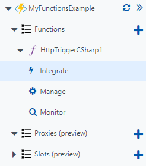
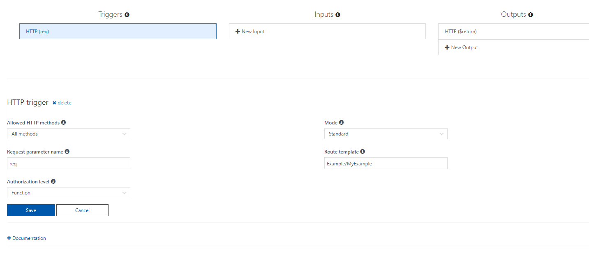

## Define the function route in the Azure portal

Routes can also be controlled from the integrate tab of your function in the Azure portal. 

Enter the route that you want your function to have in the Route template box on the page.

[!include]

- The Azure portal allows you to change your routes in the Integrate tab.
- If you are using continuous deployment for your functions, any settings changed will be reset on redeployment.

[!include]

- [Settings for HTTP and webhook bindings](https://docs.microsoft.com/azure/azure-functions/functions-bindings-http-webhook)