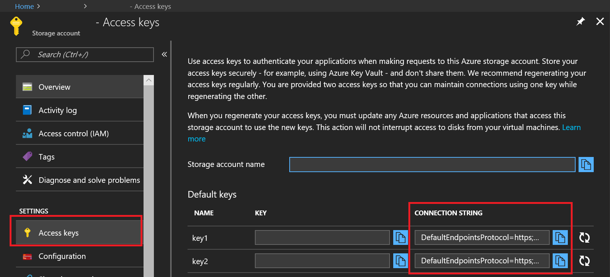

# Azure Storage SDK for Unity

[!include[](../../includes/header.md)]

## Azure Storage for Gaming

[Azure Storage](https://docs.microsoft.com/azure/storage/) provides different types of storage that could be used in a variety of gaming scenarios.  For example, you could build a system using Blob Storage to save a user's game state for later play.  Table Storage could be used as a quick and easy database to store simple values.

> [!IMPORTANT]
> This is an experimental Unity SDK for Azure Storage.  As such, please note that this SDK is not supported and is not provided by the Azure Storage team.  If you run into problems, please let us know using the [GitHub Issues](https://aka.ms/azsdks-unity-issues) page for the SDK.

[](https://aka.ms/azsdks-unity)
[](https://aka.ms/azstorage-unitysdk)

## Requirements

* [Unity 2018.1, .2, or .3](https://unity3d.com/)
  * Unity 2018.2 (or greater) is required for proper SSL support.
  * If you are using Unity 2017, please check out our [Unity 2017 SDK](./azure-storage-unity-2017.md).
  * Unity 2019.x and greater are not supported and will not work with these SDKs.
* [An Azure Storage account (Sign up for free!)](https://aka.ms/azfreegamedev)

## Compatibility

This has been tested with the following Unity exporters.  Others wil likely work, however we haven't tested every possible platform and combination.  Please let us know if you've had success!

* Windows/Mac Standalone
* iOS
* Android
* UWP (IL2CPP)
* Unity Editor

## Import the SDK

To import the SDK into your own project, make sure you have downloaded the latest [.unitypackage](https://aka.ms/azstorage-unitysdk) from GitHub.  Then, do the following:

[!include[](include/unity-import.md)]

Please refer to the [Azure Storage Docs](https://docs.microsoft.com/azure/storage/) for even more samples and tutorials on using the API.

## Unity 2018.1 and SSL support

Due to a limitation in Unity 2018.1 (fixed in 2018.2), HTTPS requests using the standard .NET networking stack (i.e. not using UnityWebRequest) will fail.  To workaround this, you will need to modify the **DefaultEndpointsProtocol** entry in your connection string to use **http** instead of **https**.  **This means your data will not be encrypted to and from the server.**  We highly recommend upgrading your project to Unity 2018.2 if possible.  Here's an example of a connection string using http:

```text
`DefaultEndpointsProtocol=http;AccountName=yourazureaccount;AccountKey=abcdef12345;EndpointSuffix=core.windows.net`
```

## Try the Sample

To use the sample, you will need to have an Azure Storage account setup along with a valid connection string.  You can learn more about that [here](https://docs.microsoft.com/azure/storage/common/storage-create-storage-account).

To use the sample, do the following:

1. Download the [Unity SDKs repo](https://aka.ms/azsdks-unity) from GitHub (or import it from the .unitypackage and continue to step 4).

1. Unzip to a location on your hard drive.

1. Open Unity 2018.1 (or greater) and point it to the **Storage** directory inside the unzipped package.

1. In the **Project** window, double-click the **AzureSample** scene inside the **AzureSamples\Storage** directory to open the main scene for the sample.

1. In this scene, select the **StorageObject** item in the **Hierarchy** window.

1. With **StorageObject** selected, you'll notice that there are blank **Connection String** entries in the **Inspector** window.  Fill in the these entries with your valid connection string as shown on the Azure portal, but remember to change the endpoint to use **http** as described above.  You can change the names of the other items if you wish, but the defaults should work as-is. You can find your connection strings in the Azure Portal as shown.

   

1. Run the project from within the editor by clicking the **Play** button.  Alternatively, you can export to the platform of your choosing and run there.

1. At this point, you can click the button for any of the four storage types and watch the output window.  If things are setup and working, you will see the sample test a standard workflow.

The code for the sample is broken out into four separate scripts, one for each storage type.  Take a look at each to learn more about how it works.

## Cosmos DB Table API

[Cosmos DB](https://docs.microsoft.com/azure/cosmos-db/introduction) is Microsoft's globally distributed, multi-model database. One of the data models available for Cosmos DB is [Table API](https://docs.microsoft.com/azure/cosmos-db/table-introduction). Applications written for Azure Table storage can migrate to Azure Cosmos DB by using the Table API with no code changes and take advantage of premium capabilities. If you have a Cosmos DB database, you can use the Table Storage client SDK we provide to access it from your Unity game. Check the instructions [here](https://docs.microsoft.com/azure/cosmos-db/create-table-dotnet#update-your-connection-string) on how to find out your connection string.

## Next Steps

* [Azure Storage Docs](https://docs.microsoft.com/azure/storage/)
