# Facebook authentication with Unity and Azure

[!include[](../../../includes/header.md)]


[](https://aka.ms/azsamples-unity)

## Overview

This article demonstrates how to incorporate Facebook authentication into a Unity project that stores high score and game telemetry data in Azure Easy Tables.

The approach uses the [Facebook Unity SDK](https://developers.facebook.com/docs/unity/) to allow users to log in to Facebook. It then uses [UnityWebRequest](https://docs.unity3d.com/Manual/UnityWebRequest.html) to send HTTP requests to an [Azure function app](https://azure.microsoft.com/services/functions/) that handles authentication and data insertion and retrieval.

### Compatibility

This approach should work for any Unity platform supported by the Facebook SDK.

* iOS
* Android
* WebGL

> [!NOTE]
> PC builds can be supported by using the [Facebook Gameroom](https://unity3d.com/partners/facebook/gameroom) build feature of Unity.

### Prerequisites

* Unity 5.6.1 or above ([free personal version](https://store.unity.com/products/unity-personal) is fine)
* Azure subscription (the [free trial](https://aka.ms/azft-gaming) or included credits from [Visual Studio Dev Essentials](https://www.visualstudio.com/dev-essentials/) are fine)
* [Visual Studio 2017](https://www.visualstudio.com/) (free Community edition is fine) with Game Development with Unity workload
* Facebook account

## Create an Azure Mobile App and configure Easy Tables

An [Azure Mobile App](https://azure.microsoft.com/documentation/learning-paths/appservice-mobileapps/) is a type of Azure App Service. This example uses the Easy Tables feature of Azure Mobile Apps to simply store data.

[!include[](include/racer_configure-easy-tables.md)]

### Set up the TestPlayerData table

1. Go back to the Easy Tables blade and click **Add** to add a second table.

1. Name the new table "**TestPlayerData**" and click **OK**. Leave the rest of the options at their default settings.

1. A notification will announce when the new table has been created.

> [!NOTE]
> These specific table names are used in the example code, so be careful about changing them.

## Create an Azure Function App

This example uses an Azure Function App for data insertion and retrieval. Our Unity app will send HTTP requests to an Azure HTTP triggered Function.

1. In the [Azure portal](https://portal.azure.com) click **Create a resource**, type "function app" in the search bar and then click **Function App** and select **Create**.

  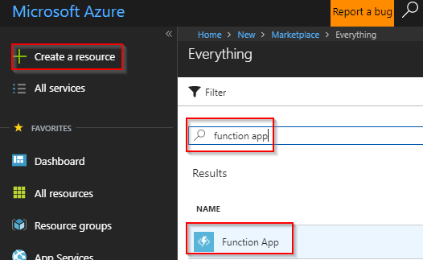

1. In the next blade, enter a name for your function app, confirm the rest of the settings (default values will work) and click **Create**. Wait a moment for the new resource to be created. A notification in the Azure portal will announce when the new Function App is ready.

  

### Create an Insert function

The Unity client will call the Insert function to insert data into our Easy Tables.

#### Create the new function

1. Once the new Function App has been created, select it in the portal.

2. Hover over the **Functions** tab and click the **+ button**.

3. Scroll down on the right side panel and click **Custom function** under the "Get started on your own" heading.

  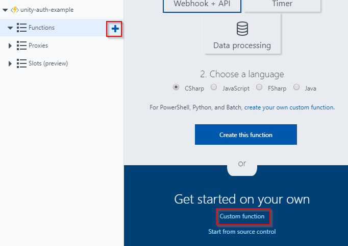

4. Select **HTTP trigger**.

5. Choose **C#** from the **Language:** dropdown.

6. Name the function `Insert`.

7. Select **Function** from the **Authorization level** dropdown.

8. Click the **Create** button.

  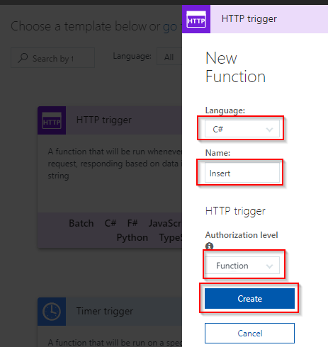

#### Add the Azure Mobile Client and Newtonsoft.Json NuGet packages to the Insert function
This example uses the Azure Mobile Client SDK to simplify authentication and data operations.

> [!NOTE]
> The code for setting up the Azure functions can be found in the sample's GitHub [repository](https://github.com/BrianPeek/AzureSamples-Unity/tree/master/MobileAppsRacerFbAuth/Azure%20Functions) as well.

1. Once the function has been created, select **View files** from the right side panel. You may need to extend the window or scroll right to find it.

2. Click **+ Add**.

3. Enter **project.json** as the new file's name and press Enter on the keyboard to create the file.

  

4. Once the new project.json file is created, select it in the **View files** list.

5. Paste the following lines into the empty project.json file:
  ```
  {
  "frameworks": {
    "net46":{
      "dependencies": {
        "Microsoft.Azure.Mobile.Client": "4.0.2"
      }
    }
   }
}
```
6. Click **Save**. If you observe the log, it should detail that the Microsoft.Azure.Mobile.Client and Newtonsoft.Json packages have been installed and compilation has succeeded.

  

#### Add the Insert function body

The Insert function receives Json parameters in an HTTP POST request sent from the Unity client.

The parameters include:

  * The name of the table to be modified.

  * The access token for Facebook authentication (the Facebook Unity SDK gets this key after the user logs in).

  * The data object to add to the table.

This insert function deserializes the JSON parameters, and then logs in and inserts the data into the appropriate table using the Azure Mobile Apps SDK.

1. Click on **run.csx** in the **View files** list to modify the function body.

2. Clear all of the initial code in the function and replace it with the following, then click **Save**:

```csharp
using System.Net;
using Microsoft.WindowsAzure.MobileServices;
using Newtonsoft.Json.Linq;

public static async Task<HttpResponseMessage> Run(HttpRequestMessage req, TraceWriter log)
{
    log.Info("C# HTTP trigger function processed a request.");

    // Update with your Mobile App url!
    MobileServiceClient client = new MobileServiceClient("INSERT_YOUR_MOBILE_APP_URL_HERE");
    dynamic data = await req.Content.ReadAsStringAsync();

    JArray arrayJson;
    dynamic authToken;
    string tableName;
    dynamic objectToInsert;
    try
    {
        // Server expects a json arrary with the format:
        // [{"access_token":"value"},{"tableName":"value"},{instanceJson}]
        arrayJson = JArray.Parse(data);
        authToken = arrayJson[0];
        tableName = arrayJson[1].Value<string>("tableName");
        objectToInsert = arrayJson[2];
    }
    catch (Exception exception)
    {
        return req.CreateErrorResponse(HttpStatusCode.BadRequest, exception);
    }
    
    // Try to log in. Return Unauthorized response upon failure.
    MobileServiceUser user = null;
    while (user == null)
    {
        try
        {
            // Change MobileServiceAuthenticationProvider.Facebook
            // to MobileServiceAuthenticationProvider.Google if using Google auth.
            user = await client.LoginAsync(MobileServiceAuthenticationProvider.Facebook, authToken);                
        }
        catch (InvalidOperationException exception)
        {
            log.Info("Log in failure!");
            return req.CreateErrorResponse(HttpStatusCode.Unauthorized, exception);
        }
    }
    // Try to Insert. Return BadRequest response upon failure.
    try
    {
        JToken insertedObject = await client.GetTable(tableName).InsertAsync(objectToInsert);
        return  req.CreateResponse(HttpStatusCode.OK, insertedObject);
    }
    catch (Exception exception)
    {
        return req.CreateErrorResponse(HttpStatusCode.BadRequest, exception);
    }
}
```

 > [!IMPORTANT]
 > Be sure to replace the string that reads `INSERT_YOUR_MOBILE_APP_URL_HERE` with the URL to your Azure Mobile App. To find this URL:

  > 1. Click **App Services** from the main left menu of the Azure portal.
  > 1. Click the name of your Mobile App from the list.
  > 1. Ensure the **Overview** tab is selected
  > 1. Copy the URL from beneath the **URL** heading.
  > 

> [!NOTE]
> If you wish to customize this code, using [Visual Studio to test and debug Azure functions](https://blogs.msdn.microsoft.com/webdev/2017/05/10/azure-function-tools-for-visual-studio-2017/) is highly recommended.

### Create a GetAllEntries function

The Unity client will call the GetAllEntries function to get a list of all the entries in a specified table.

#### Create the new function

1. Click **Function Apps** in the Azure portal and select your function app.

1. Hover the **Functions** tab and click the **+ button**.

1. Scroll down on the right side panel and click **Custom function** under the "Get started on your own" heading.

1. Select **HTTP trigger**.

1. Choose **C#** from the **Language:** dropdown.

1. Name the function `GetAllEntries`.

1. Select **Function** from the **Authorization level** dropdown.

1. Click the **Create** button.

#### Add the Azure Mobile Client and Newtonsoft.Json packages to the GetAllEntries function

> [!NOTE]
> The code for setting up the Azure functions can be found in the sample's GitHub [repository](https://github.com/BrianPeek/AzureSamples-Unity/tree/master/MobileAppsRacerFbAuth/Azure%20Functions) as well.

1. Once the function has been created, select **View files** from the right side panel. You may need to extend the window or scroll right to find it.

1. Click **+ Add**.

1. Enter **project.json** as the new file's name and press Enter on the keyboard to create the file.

1. Once the new project.json file is created, select it in the **View files** list.

1. Paste the following lines into the empty project.json file:

```
{
  "frameworks": {
    "net46": {
      "dependencies": {
        "Microsoft.Azure.Mobile.Client": "4.0.2"
      }
    }
  }
}
```

1. Click **Save**. If you observe the log, it should detail that the Microsoft.Azure.Mobile.Client and Newtonsoft.Json packages have been installed and compilation has succeeded.

#### Add the GetAllEntries function body

The GetAllEntries function receives JSON parameters in an HTTP POST request sent from the Unity client.

The parameters include:

* The access token for Facebook authentication (the Facebook Unity SDK gets this key after the user logs in).

* The name of the table from which to get all entries.

This GetAllEntries function deserializes the Json parameters, and then logs in and adds a list of the specified table entries into an HTTP response that is sent back to the Unity client.

1. Click on **run.csx** in the **View files** list to modify the function body.

2. Clear all of the initial code in the function and replace it with the following, then click **Save**:

```csharp
using System.Net;
using Microsoft.WindowsAzure.MobileServices;
using Newtonsoft.Json.Linq;

public static async Task<HttpResponseMessage> Run(HttpRequestMessage req, TraceWriter log)
{
    log.Info("C# HTTP trigger function processed a request.");
    
    // Update with your Mobile App url!
    MobileServiceClient client = new MobileServiceClient("INSERT_YOUR_MOBILE_APP_URL_HERE");
    dynamic data = await req.Content.ReadAsStringAsync();
    JArray arrayJson;
    dynamic authToken;
    string tableName;
    try
    {
        // Server expects a json arrary with the format:
        // [{"access_token":"value"},{"tableName":"value"}]
        arrayJson = JArray.Parse(data);
        authToken = arrayJson[0];
        tableName = arrayJson[1].Value<string>("tableName");
    }
    catch (Exception exception)
    {
        return req.CreateErrorResponse(HttpStatusCode.BadRequest, exception);
    }
    
    // Try to log in. Return Unauthorized response upon failure.
    MobileServiceUser user = null;
    while (user == null)
    {
        try
        {
            // Change MobileServiceAuthenticationProvider.Facebook
            // to MobileServiceAuthenticationProvider.Google if using Google auth.
            user = await client.LoginAsync(MobileServiceAuthenticationProvider.Facebook, authToken);
        }
        catch (InvalidOperationException exception)
        {
            log.Info("Log in failure!");
            return req.CreateErrorResponse(HttpStatusCode.Unauthorized, exception);
        }
    }

    // Try to get all entries as a list. Return BadRequest response upon failure.
    try
    {
        var table = client.GetTable(tableName);
        var list = await table.ReadAsync(string.Empty);
        return req.CreateResponse(HttpStatusCode.OK, list);
    }
    catch (Exception exception)
    {
        return req.CreateErrorResponse(HttpStatusCode.BadRequest, exception);
    }
}
```

> [!IMPORTANT]
> Be sure to replace the string that reads `INSERT_YOUR_MOBILE_APP_URL_HERE` with the URL to your Azure Mobile App.

## Facebook setup

### Create a new Facebook app

To use Facebook authentication, you must create a new Facebook app.

1. Go to [developers.facebook.com/apps](https://developers.facebook.com/apps) and log in. If you haven't already, you'll need to upgrade your account to a developer account.

2. Click **Add a New App**.

3. Enter a **Display Name** and **Contact Email** for the new app.

  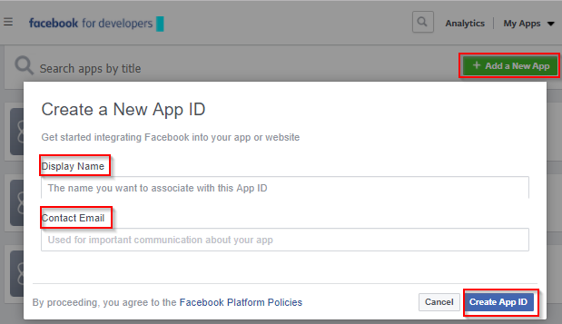

1. Complete the captcha.

1. Select **Basic Settings** from the left side menu. Take note of the **App ID** and **App Secret** associated with your new app. You may need to click the **Show** button and log in to view your app secret. These values will be used later in the example.

  

> [!IMPORTANT]
> The app secret is an important security credential. Do not share this secret with anyone or distribute it within a client application.

### Add the Facebook Login product

1. Select **Add Product** from the left side menu.

1. Hover the mouse over **Facebook Login** from the list of products and then click the **Set Up** button that appears. Facebook will display a page about running a quickstart for various platforms. This is not necessary for this example. Simply clicking the **Set Up** button is sufficient.

  

1. The Facebook account which was used to register the application is an administrator of the app. At this point, only administrators can sign into this application. To authenticate other Facebook accounts, click **App Review** on the left side menu and enable **Make public** to enable general public access using Facebook authentication.

## Enable Facebook authentication on Azure

### Configure Azure Mobile App authentication settings

1. In the [Azure portal](https://portal.azure.com), navigate to the Mobile App created earlier in the example.

1. Click **Authentication / Authorization** in the left side menu.

1. Click the **On** button under the label "App Service Authentication."

1. Click **Facebook** from the list of authentication providers.

1. Paste in the **App ID** and **App Secret** from the Facebook app you created earlier in the example, then click **OK**.

1. Click **Save** at the top of the **Authentication / Authorization** settings blade. Azure will present a notification once the settings have successfully saved.

  

### Set permissions for Easy Tables

1. Click **Easy Tables** in the left side settings menu for your Azure Mobile App.

1. For each of your tables, **click the table name** to open the table.

1. Click **Change permissions** then change each of the drop downs to **Authenticated access only**, then click **Save**.

  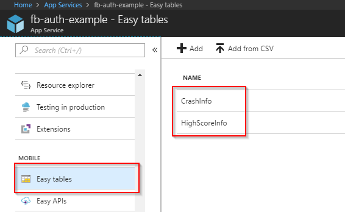

  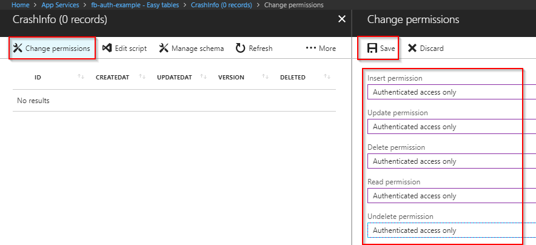

## Download the sample Unity project

Clone or download the project from the [AzureSamples-Unity repo](https://aka.ms/azsamples-unity) on GitHub. 

* On the GitHub site, click the **Clone or download** button to get a copy of the project to work with.
* This project is located within the `MobileAppsRacerFbAuth` directory.

## Configure the Facebook SDK in the Unity project

The sample Unity project already has the Facebook SDK imported. In new Unity projects, you can download the [Facebook SDK for Unity](https://developers.facebook.com/docs/unity) and import the .unitypackage file into your project.

> [!NOTE]
> There is a bug in the Facebook Unity SDK v7.11.0 that prevents initialization on WebGL. This example was tested with the [previous version](https://developers.facebook.com/docs/unity/change-log) (v7.10.1).

1. Open the Unity project contained within the `MobileAppsRacerFbAuth` directory of the repository.

1. Click **Facebook > Edit Settings** in the Unity menu.

  

1. In the Facebook settings that open in the Unity Inspector, paste in your Facebook **App Id**.

## Set up the Facebook SDK for your chosen platform

# [iOS](#tab/ios)

### Configure Unity build and player settings

1. Choose **File > Build Settings...** from the Unity menu.

1. Select the **iOS** platform and click **Switch Platform**.

1. Once the platform has been switched to iOS, click **Player Settings.**

1. Find the **Identification** section in the Inspector and enter a valid **Bundle Identifier**. This should be in the format of `com.CompanyName.ProductName`.

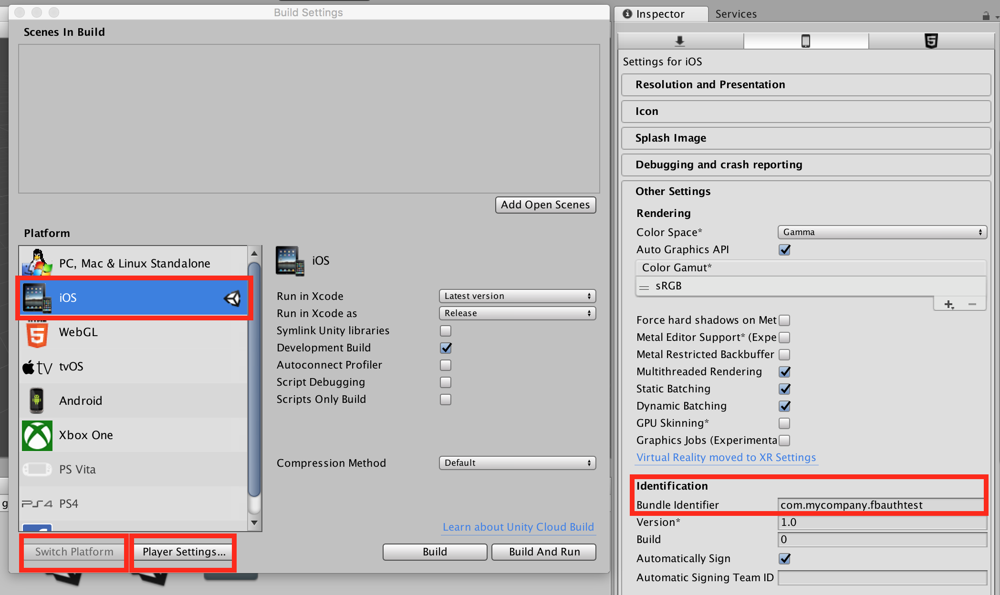

### Add the iOS platform information to your Facebook app

1. Go to [developers.facebook.com/apps](https://developers.facebook.com/apps) and select your app.

1. Click **Settings**. Near the bottom of the **Basic** settings page, click the **Add Platform** button.

  

1. Select **iOS**.

1. Copy and paste the **Bundle ID** from your Unity project's iOS Player Settings into the corresponding field of your Facebook app's iOS platform settings.

1. Click **Save Changes**.

  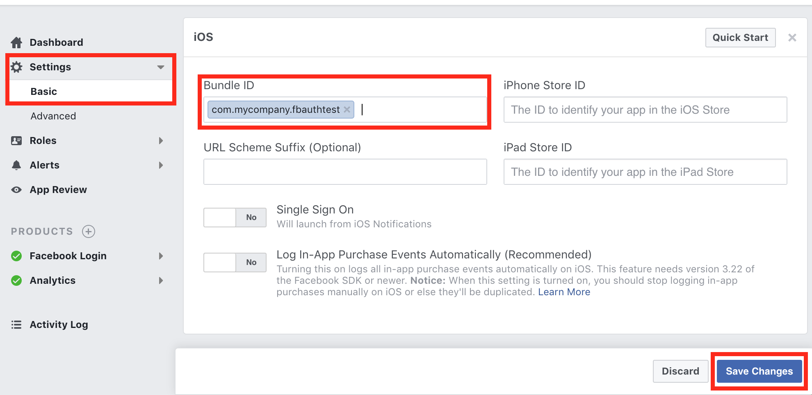

# [Android](#tab/android)

> [!IMPORTANT]
> Before continuing, ensure your Unity Android development environment is properly configured. Consult the [Getting started with Android development](https://docs.unity3d.com/Manual/android-GettingStarted.html) documentation for help.

### Fix any Facebook SDK Android warnings

1. In the Unity menu, click **Facebook > Edit Settings** to open the FacebookSettings in the Inspector.  

1. Expand the **Android Build Facebook Settings** section. If you are missing prerequisites, a number of warnings may appear here next to yellow exclamation point images.

  

> [!NOTE]
> If these warnings don't appear for you, you can safely skip the related steps and progress to [configure the Unity build and player settings](https://docs.microsoft.com/sandbox/gamedev/unity/samples/azure-facebook-auth-unity?tabs=android#configure-the-unity-build-and-player-settings).

#### Fix the missing debug keystore file warning


1. Install [Android Studio](https://developer.android.com/studio/index.html).

1. Create a new project with the default options. The project will not be used and can safely be deleted once created. The process of creating the new project corrects the missing android debug keystore warning.

1. Restart the Unity editor.

#### Fix the OpenSSL not found warning


1. Download and install the [Win64 Open SSL installer](https://slproweb.com/products/Win32OpenSSL.html) (do not download the "light" version).

  

1. Add OpenSSL to your path environment variable. In the Windows search, type **environment**, then click **Edit the system environment variables** entry.

  

1. Click **Environment Variables...**.

  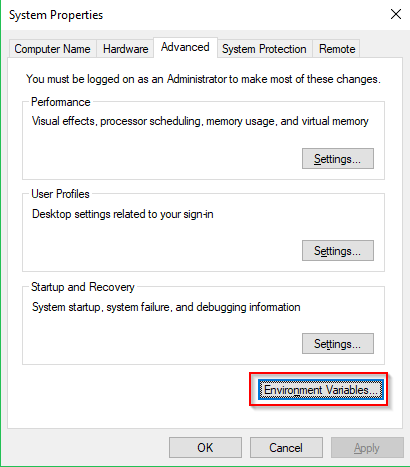

1. In the lower **System variables** section, select the **Path** variable and then click **Edit...**.

  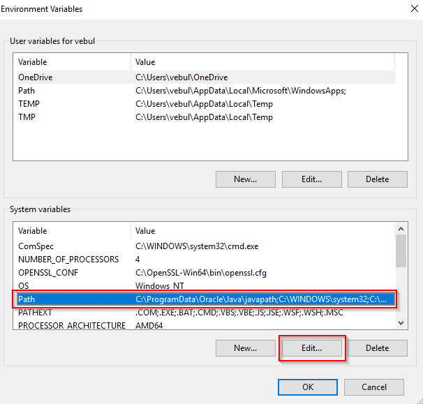

1. Click **New** and type in the path of the **OpenSSL-Win64\bin\** directory. Then click **OK**.

  

#### Fix the Keytool not found warning

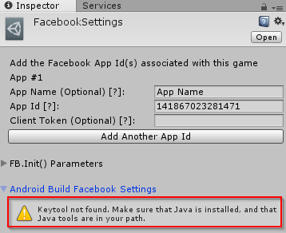

1. Download and install the [Java JDK](https://www.oracle.com/technetwork/java/javase/downloads/jdk8-downloads-2133151.html). Unity requires JDK 8 (1.8), 64-bit version.

1. Add the JDK to your path environment variable. In the Windows search, type **environment**, then click **Edit the system environment variables** entry.

1. Click **Environment Variables...**.

1. In the lower **System variables** section, select the **Path** variable and then click **Edit...**.

1. Click **New** and type in the path of the **jdk\bin\** directory. Then click **OK**.

  

### Configure the Unity build and player settings

1. In the Unity menu, click **File > Build Settings...**.

1. Select **Android** in the list of platforms and then click **Switch Platform**.

1. Once the platform has been switched to Android, click **Player Settings.**

1. Find the **Identification** section in the Inspector and enter a valid **Package Name**. This should be in the format of `com.CompanyName.ProductName`.

  

### Add the Android platform information to your Facebook app

1. In the Unity menu, select **Facebook > Edit Settings**.

1. Expand the **Android Build Facebook Settings**. Note the location of the **Package Name**, **Class Name**, and **Debug Android Key Hash** values as they must be copied and pasted in a later step.

1. Go to [developers.facebook.com/apps](https://developers.facebook.com/apps) and select your app.

1. Click **Settings**. Near the bottom of the **Basic** settings page, click the **Add Platform** button.

  

1. Select **Android**.

1. Copy and paste the **Package Name**, **Class Name**, and **Debug Android Key Hash** from your Unity project's **Android Build Facebook Settings** into the corresponding fields of your Facebook app's Android platform settings.

1. Click **Save Changes**.

  

# [WebGL](#tab/webgl)

> [!TIP]
> Unity WebGL builds can be hosted on Azure. For more information, see this [blog entry](https://blogs.msdn.microsoft.com/uk_faculty_connection/2017/10/09/hosting-your-unity-game-on-azure/).

### Configure Unity build settings

1. Choose **File > Build Settings...** from the Unity menu.

1. Select the **WebGL** platform and click **Switch Platform**.

  > [!NOTE]
  > If you notice a compiler error regarding an assembly with the same name already being imported, try saving your project, closing Unity, and reopening.

### Configure web platform for your Facebook app

1. Go to [developers.facebook.com/apps](https://developers.facebook.com/apps/) and select your app.

1. At the dashboard, select **Settings** and choose **Basic**.

  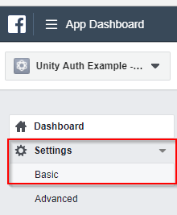

1. Click **Add Platform**.

  

1. Select **Website**.

  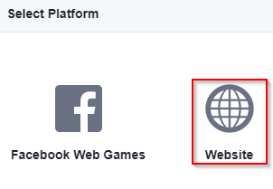

1. Enter the **Site URL** where your WebGL build is hosted and click **Save**.

  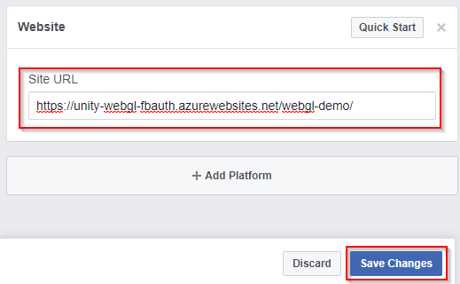

### Configure CORS for Azure Function App

1. In the [Azure portal](https://portal.azure.com), navigate to the Function App created earlier in the example.

1. Click the **Platform features** tab and then select **CORS**.

  

1. Click the empty box at the bottom of the **Allowed Origins** list and type in the URL where your WebGL build is hosted.

1. Click **Save**.

  

> [!IMPORTANT]
> The Facebook Unity SDK uses popups for logging in on WebGL builds. Be sure to enable popups on your browser or the log in process may be blocked.

---

## Try the test scene

> [!NOTE]
> The Facebook Unity SDK does not support logging in in the Unity editor. To test in the editor, paste a [debug access token](https://developers.facebook.com/tools/accesstoken/) into the `LogInUser()` function in `FacebookLogin.cs`.

1. In the [Azure portal](https://portal.azure.com), navigate to the Function App you created for this example and copy the URL.

  

1. Open the file **EasyTableClient.cs** and change `private const string url = "FUNCTION_APP_URL"` to match the URL of the function app you created for this sample.

1. Return the Azure portal then navigate to the **Function app settings** and copy the **default** Host Key.

1. Back in **EasyTableClient.cs**, change `private const string hostKey = "FUNCTION_APP_HOST_KEY"` to match the **default** Host Key of your Function App.

  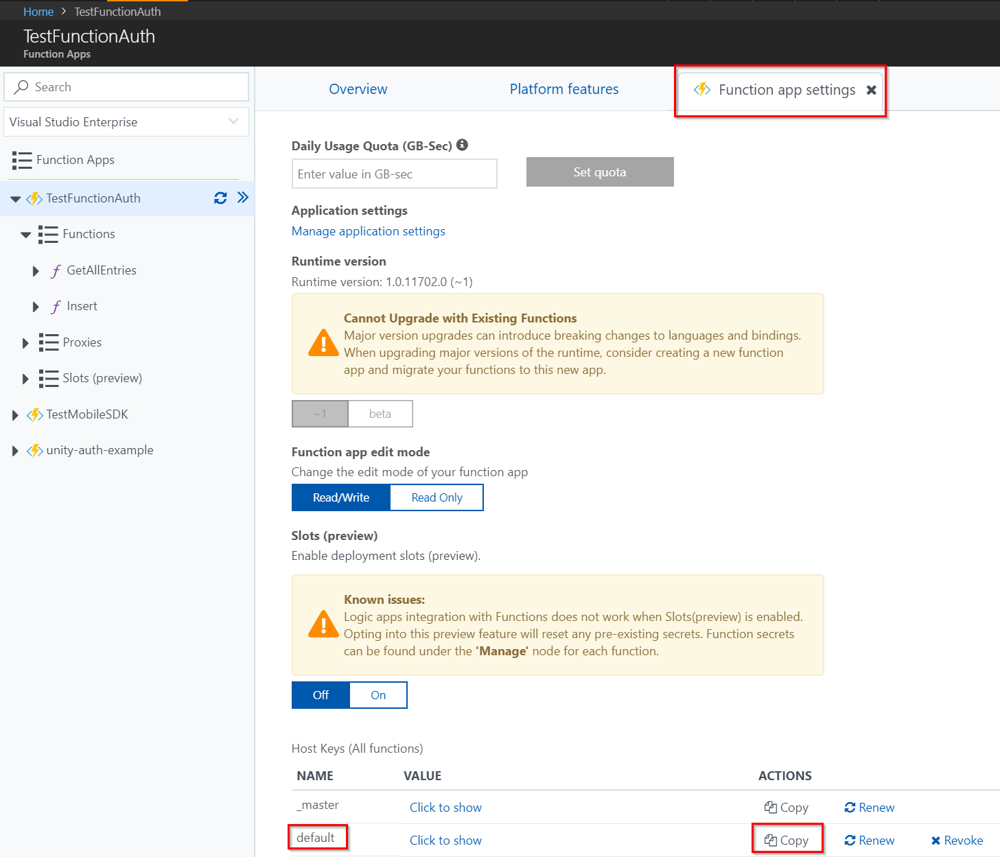

1. In the Unity menu, choose **File > Build Settings...** and add the `Assets/AuthSample/Scenes/test scene.unity` file to the index 0 position of the **Scenes in Build** list.

1. Ensure a platform supported by the Facebook Unity SDK is selected (Android, iOS, WebGL).

1. For iOS or Android, choose **Build and Run**. Choose an appropriate path to save the build. For WebGL, click **Build** and upload the build to a hosting location on the web.

1. Once the game is running, press the **LOGIN** button.

  

1. This should present a Facebook login screen. Complete the Facebook login process.

  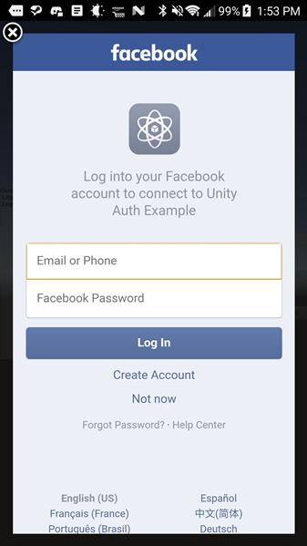

1. Press **INSERT**. This will add test data to the TestPlayerData table on your Azure Mobile App. Observe the **Output** window to see if the insert operation completed.

1. Press the **GET ALL ENTRIES** button. The **Output** window should print the count of entries in the TestPlayerData table. Verify that the count goes up after each new insert. Additionally, you can navigate to the TestPlayerData table in the Easy Tables section of your Mobile App on the [Azure portal](https://portal.azure.com) and manually inspect the entries.

> [!NOTE]
> The App Service will time out after a period of inactivity. It may take a moment to spin back up when it is hit again, so if the first test fails, please try again to ensure the service is in its running state.

## Try the sample racing game

1. In the Unity menu, choose **File > Build Settings...** and ensure the the scenes inside `Assets/AuthSample/Scenes/` to the **Scenes in Build** section.

1. Ensure that `MenuScene` is in the top, **index 0** position in the list of **Scenes in Build**.

  

1. Ensure that a supported / configured platform is selected, make a build and deploy it to the target platform.

1. Once the build is running on the target platform, press the **Log in** button.

1. This should present a Facebook login screen. Complete the Facebook login process.

1. Press the **Race!** button. Before viewing the leaderboard or heatmap, it's best to create some sample data by completing the race at least once.

1. Complete a lap around the course and cross the checkered finish line.

1. Once a lap has completed, the High Score dialog should come up since there will be no other scores to compete with. Type in a name and press **Submit**. The high score, along with data about where the player crashed into the wall during the race are sent to Azure.

1. Now use the menu to view either the **Crash Heatmap** or **Leaderboard**. Each will display data loaded from Azure.