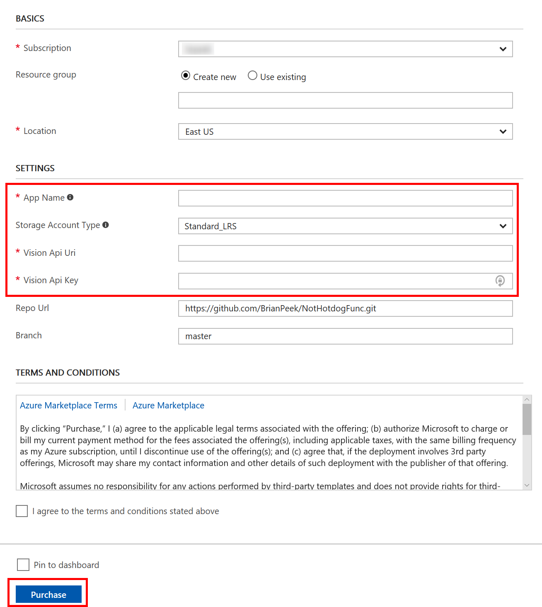

# NotHotdog

[!include[](../includes/header.md)]

If you're familiar with [HBO's Silicon Valley](http://www.hbo.com/silicon-valley), you'll understand the reference for this project.  If not, it'll seem very random.  Either way, it's still very stupid.  [NotHotdog](https://github.com/BrianPeek/NotHotdogFunc) is an Azure Function that uses the [Computer Vision API](https://docs.microsoft.com/azure/cognitive-services/computer-vision/) in [Cognitive Services](https://docs.microsoft.com/azure/cognitive-services/) to determine if a provided image contains a hotdog or not.  

[](https://portal.azure.com/#create/Microsoft.Template/uri/https%3A%2F%2Fraw.githubusercontent.com%2FBrianPeek%2FNotHotdogFunc%2Fmaster%2Fazuredeploy.json)

> [!TIP]
> If you'd like to train your own model using the [Custom Vision Service](https://docs.microsoft.com/azure/cognitive-services/custom-vision-service/home) to recognize images for your domain, check out the [NotBacon](/sandbox/demos/notbacon) article.

## Requirements
* An [Azure](https://azure.microsoft.com/en-us/free/) account
* To build and test locally, [Visual Studio 2017](https://visualstudio.com) version 15.3 or higher

## Links
* [NotHotdogFunc Repo](https://github.com/BrianPeek/NotHotdogFunc)

## What's It Do?
Give the Azure Function a URL to an image, or POST the image data to the endpoint, and it will return a JSON payload stating whether the picture contains a hotdog.

## Configuration
There are two parts to settings this up to try out:

### Computer Vision API
To use the [Computer Vision API](https://docs.microsoft.com/azure/cognitive-services/computer-vision/), you will need an endpoint and key.

1. Browse to the [Cognitive Services API portal](https://azure.microsoft.com/try/cognitive-services/my-apis/), logging in if necessary.
1. Click the **Get API Key** button in the **Computer Vision API** section.
   
1. You will be given an endpoint and 2 keys.  Copy these to a safe place, but note that you can always review your information later at [https://azure.microsoft.com/try/cognitive-services/my-apis/](https://azure.microsoft.com/try/cognitive-services/my-apis/).
   

If you have already used up your trial for the Computer Vision API, you can register for a production key using [these instructions](https://docs.microsoft.com/azure/cognitive-services/cognitive-services-apis-create-account).

### Azure Deployment
1. Click the [Deploy to Azure](https://portal.azure.com/#create/Microsoft.Template/uri/https%3A%2F%2Fraw.githubusercontent.com%2FBrianPeek%2FNotHotdogFunc%2Fmaster%2Fazuredeploy.json) link here or the button above.
1. Enter the information for your Azure subscription, such as the resource group, unique App Name, etc.  This App Name will become part of the URL.  You'll also need the Computer Vision API key and URL from the previous step.
   

The function application will be deployed and the GitHub repo above will be setup as the deployment source.  Additionally, the key and endpoint you entered will be automatically configured.  Copy down the URL to your function, which will be **https://&lt;appname&gt;.azurewebsites.net** , with the Function endpoint being **https://&lt;appname&gt;.azurewebsites.net/api/NotHotdog** .

### Running Locally
You can clone the [repo](https://github.com/BrianPeek/NotHotdogFunc) and run the project locally.  This requires Visual Studio 2017 version 15.3 or higher, with the Azure Development workload installed.  For more information, see [the docs](https://docs.microsoft.com/en-us/azure/azure-functions/functions-develop-vs).  Note that if you opt to run locally, you will need to create a **local.settings.json** file in the same directory as the function with your endpoint and API keys.  Here's an example -- simply fill in the **VisionKey** and **VisionUri** with the values given to you by the service, and leave the rest blank.

```json
{
	"IsEncrypted": false,
	"Values": {
		"AzureWebJobsStorage": "",
		"AzureWebJobsDashboard": "",
		"VisionKey": "<your API key>",
		"VisionUri": "https://westcentralus.api.cognitive.microsoft.com/vision/v1.0"
	}
}
```

## How to Run
The Azure Function is now configured and running, and will be available at **https://&lt;sitename&gt;.azurewebsites.net/api/NotHotdog** . To test it, let's use [cURL](https://curl.haxx.se/) to hit the endpoint, providing both a URL and POST data:

### Link to image
```
curl http://<appname>.azurewebsites.net/api/NotHotdog?url=https://upload.wikimedia.org/wikipedia/commons/5/53/Hot_dog_on_a_plate_-_Evan_Swigart.jpg
```

```json
{"isHotdog":"true"}
```

### POST image data
```
curl --data-binary "@not-a-hotdog.jpg" http://<appname>.azurewebsites.net/api/NotHotdog
```

```json
{"isHotdog":"false"}
```

Of course, you could call this from a web-based back-end, a mobile app, or anything else.  Simply hit the endpoint in either way and parse the JSON response.

## How it Works
This Azure Function was created with the new [Azure Functions Tools for Visual Studio](https://docs.microsoft.com/azure/azure-functions/functions-develop-vs) included with the 15.3 update.  To create a new Function, ensure the Azure Development workload is installed and then create a new Azure Functions project:


After the project is created, right-click on the project in **Solution Explorer** and select **Add > New Item...** from the context menu, then select **Azure Function** from the window that pops up, giving it a new name.


Finally, select the [trigger](https://docs.microsoft.com/azure/azure-functions/functions-triggers-bindings) action, in this case **Http trigger**, and select its Access rights.  Anonymous lets anyone access the function endpoint.


For more details on these tools, please see the [official docs](https://docs.microsoft.com/en-us/azure/azure-functions/functions-develop-vs).

To use the Computer Vision API from C#, a NuGet reference was set to the [Microsoft.ProjectOxford.Vision](https://www.nuget.org/packages/Microsoft.ProjectOxford.Vision/) package, which contains the full API for .NET projects.

The steps above have already done in the [sample project](https://github.com/BrianPeek/NotHotdogFunc), and a function named **NotHotdog** was created.  The code for the function is only a few lines.  Here's a very condensed version (see the [source code](https://github.com/BrianPeek/NotHotdogFunc/blob/master/src/NotHotdog.cs) for the full version).

```csharp
[FunctionName("NotHotdog")]
public static async Task<HttpResponseMessage> Run([HttpTrigger(AuthorizationLevel.Anonymous, "get", "post", Route = null)]HttpRequestMessage req, TraceWriter log)
{
	// grab the key and URI from the portal config
	string visionKey = Environment.GetEnvironmentVariable("VisionKey");
	string visionUri = Environment.GetEnvironmentVariable("VisionUri");

	// create a client and request Tags for the image submitted
	VisionServiceClient vsc = new VisionServiceClient(visionKey, visionUri);
	VisualFeature[] vf = { VisualFeature.Tags };
	AnalysisResult result = null;

	// get the image data POST'ed to us
	Stream stream = await req.Content.ReadAsStreamAsync();

	// ask Computer Vision API to analyze it
	result = await vsc.AnalyzeImageAsync(stream, vf);

	// check if a "hotdog" tag is returned
	if(result.Tags.Select(tag => tag.Name.ToLowerInvariant()).Contains("hotdog"))
		return GetResponse(req, true);
}
```

## Next Steps
Here are links to the docs for the items discussed above.  Play around with the project and feel free to leave comments on the article, [open issues](https://github.com/BrianPeek/NotHotdogFunc/issues) in the repo, or submit [pull requests](https://github.com/BrianPeek/NotHotdogFunc/pulls) with fixes and new features.

* [Cognitive Services](https://docs.microsoft.com/azure/cognitive-services/)
* [Computer Vision API](https://docs.microsoft.com/azure/cognitive-services/computer-vision/)
* Check out [NotBacon](/sandbox/demos/notbacon) for a variant of this using the Custom Vision Service trained with images of bacon!
