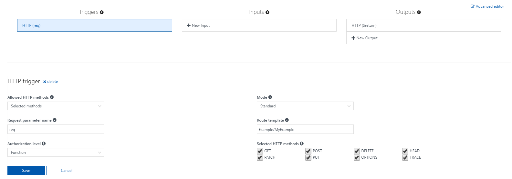

## Allowing HTTP verbs in the Azure portal

If you want to control which HTTP verbs are available for your function in the Azure portal, access your function's integrate tab.

On the integrate page under "Allowed HTTP methods", you can choose either All methods or Selected methods. If you select All methods, there isn't anything else to do. With selected methods, eight checkboxes appear for you to customize access to your app:

[!include]

- Controlling HTTP verb permissions for your function can be as easy as changing a few settings in the integrate tab in the Azure portal.

[!include]

- [Azure REST API](https://docs.microsoft.com/en-us/rest/api/)