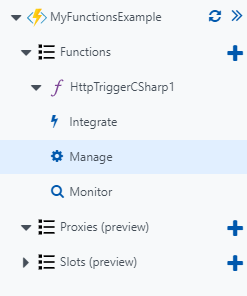

## Getting your function and host keys in the Azure portal

If your function's authorization is set to function or admin, all requests must contain the function key or the host key to access them. To get to your keys in the Azure portal, go to the management tab for the function.

On the manage page you will see your function keys, as well as options to create, remove, or update any function keys.

Host keys are identical across functions in the same function app, but function keys are unique to each function.

[!include]

- Keys can be accessed and managed in the manage tab of your function in the Azure portal.
- Every function has its own function key, but every function in a function app shares a host key.

[!include]

[More on keys and what they are used for](https://docs.microsoft.com/en-us/azure/azure-functions/functions-bindings-http-webhook#keys)