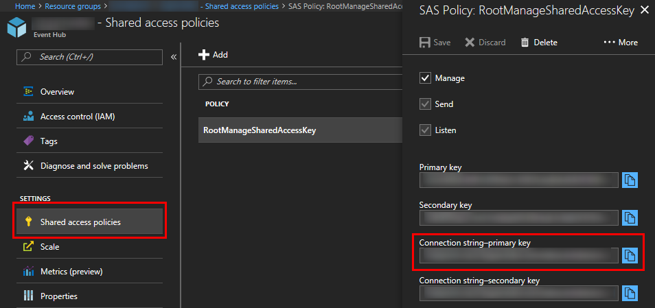
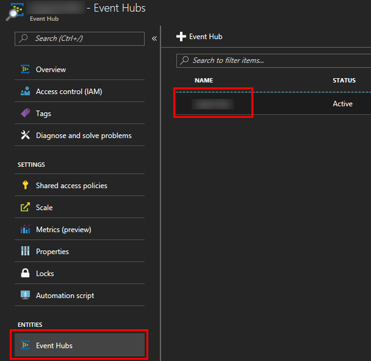

# Azure Event Hubs SDK for Unity

[!include[](../../includes/header.md)]

> [!IMPORTANT]
> This is an experimental Unity SDK for Azure Event Hubs.  As such, please note that this SDK is not supported and is not provided by the Azure Event Hubs team.  If you run into problems, please let us know using the [GitHub Issues](https://github.com/BrianPeek/AzureSDKs-Unity/issues) page for this fork.

[](https://github.com/Azure/azure-event-hubs-dotnet)
[](https://aka.ms/azeventhubs-unitysdk)

## Azure Event Hubs for Gaming

Azure Event Hubs is a real-time custom event ingestion service that can collect and store millions of events per second. Events can then be analyzed in real-time using [Azure Stream Analytics](https://azure.microsoft.com/en-us/services/stream-analytics/) or stored to [Azure Storage](https://azure.microsoft.com/en-us/services/storage/) or [Azure Data Lake Store](https://azure.microsoft.com/en-us/services/data-lake-store/) for processing at a later time. Analysis of this data could reveal various insights about player's performance/behavior during the game as well as be utilized in creation of other types of metrics (e.g. daily/weekly/monthly active users, churn, user sessions, transactions etc.).

## Requirements

* [Unity 2017.1 (or greater)](https://unity3d.com/)
  * Unity 2017.1 includes a new scripting runtime that supports .NET 4.6.  This feature allows us to use the existing Azure SDKs with some tweaks.  Please see [this blog post from Unity](https://blogs.unity3d.com/2017/07/11/introducing-unity-2017/) for more information.
* [An Azure Event Hubs account (Sign up for free!)](https://aka.ms/azfreegamedev)

## Compatibility

This has been tested with the following Unity exporters.  Others may work -- we haven't tested every platform, so please let us know if you've had success!

* Windows Standalone
* Mac Standalone (with Unity 2017.2.0p3)
* UWP (.NET)
* Android (Mono)
* Unity Editor
* iOS (the `link.xml` file in the `Assets` sample folder works around an IL2CPP issue dealing with [bytecode stripping](https://docs.unity3d.com/Manual/IL2CPP-BytecodeStripping.html))

## Known Issues and Limitations

There are a few known issues and workarounds.

### Unity and SSL support

> [!WARNING]
> Due to a Unity limitation, HTTPS requests using the standard .NET networking stack (i.e. not using UnityWebRequest) will fail due to Mono's empty certificate store. To workaround this, you will need to modify the **ServicePointManager.CertificatePolicy** with a custom CertificatePolicy which will accept all certificates as shown.
>
>**This means that data transfer will happen in an insecure manner.**

```csharp
    public class CustomCertificatePolicy : ICertificatePolicy
    {
        public bool CheckValidationResult(ServicePoint sp,
            X509Certificate certificate, WebRequest request, int error)
        {
            return true;
        }
    }

    //...

    ServicePointManager.CertificatePolicy = new CustomCertificatePolicy();
```

### iOS Builds

If you hit the [known issue](https://issuetracker.unity3d.com/issues/ios-il2cpp-il2cpp-error-for-method-system-dot-void-system-dot-data-dot-constraintcollection-clear-crashes-whiled-building-for-ios) where Unity iOS exports fail with an error of:

```text
IL2CPP error for method 'System.Void System.Data.ConstraintCollection::Clear()'
```

...please update to Unity 2017.3, 2017.2.0p2, or 2017.1.1p2 (or higher).

[!include[](include/uwp-known-issues.md)]

### Other Platforms

We have not had success in compiling or running games using the following platforms:

* UWP (IL2CPP)
* Android (IL2CPP)
* WebGL - System.Threading is used in Event Hubs DLLs and Unity WebGL does not support this

We will continue working on these and update the documentation as soon as we find fixes.

## Import the SDK

To import the SDK into your own project, make sure you have downloaded the latest [.unitypackage](https://aka.ms/azeventhubs-unitysdk) from GitHub.  Then, do the following:

[!include[](include/unity-import.md)]

Please refer to the [Azure Event Hubs Docs](https://docs.microsoft.com/en-us/azure/event-hubs/) for even more samples and tutorials on using the API.

## Try the Sample

To use the sample, you will need to have an Azure Event Hubs account with a valid Event Hubs connection string. You'll also need to create an event hub on this account. You can check the Event Hubs documentation [here](https://docs.microsoft.com/en-us/azure/event-hubs/event-hubs-create) to understand how to complete this task.

To use the sample, do the following:

1. Download the [Unity SDKs repo](https://github.com/BrianPeek/AzureSDKs-Unity) from GitHub (or import it from the .unitypackage and continue to step 4).

1. Unzip to a location on your hard drive.

1. Open Unity 2017.1 (or greater) and point it to the **EventHubs** directory inside the unzipped package.

1. In the **Project** window, double-click the **EventHub** scene inside the **Assets\AzureSamples\EventHubs** directory to open the main scene for the sample.

1. In this scene, select the **EventHubsObject** item in the **Hierarchy** window.

1. With **EventHubsObject** selected, you'll notice that there are two blank entries in the **Inspector** window, called **Eh Connection String** and **Eh Entity Path**. Fill in these entries with your own Event Hubs connection string and Event Hub name, respectively. You can find them both in the Azure Portal as shown below.

   

   

1. Run the project from within the Unity Editor by clicking the **Play** button.  Alternatively, you can export to the platform of your choosing and run there.

1. To test that the events you are sending are correctly arriving to your Event Hubs account, you can use [Event Hubs capture](https://docs.microsoft.com/en-us/azure/event-hubs/event-hubs-capture-enable-through-portal) and monitor your Storage/Data Lake Store account. Alternatively, you can create a simple .NET console app with a class that implements the **IEventProcessor** interface, like the one described [here](https://docs.microsoft.com/en-us/azure/event-hubs/event-hubs-dotnet-standard-getstarted-receive-eph).

## Next Steps

* [Azure Event Hubs Docs](https://docs.microsoft.com/en-us/azure/event-hubs/)
* [Event Hubs as input to Azure Stream Analytics](https://docs.microsoft.com/en-us/azure/stream-analytics/stream-analytics-define-inputs)
* [Capture Event Hubs data to Azure Storage or Azure Data Lake Store](https://docs.microsoft.com/en-us/azure/event-hubs/event-hubs-capture-enable-through-portal)
* [Azure Data Lake Store documentation](https://docs.microsoft.com/en-us/azure/data-lake-store/)
