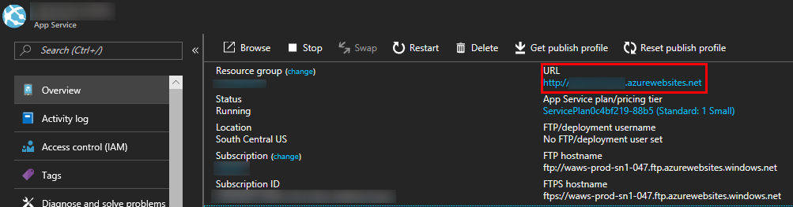

# Azure Mobile Apps SDK for Unity

[!include[](../../includes/header.md)]

> [!IMPORTANT]
> This is an experimental Unity SDK for Azure Mobile Apps.  As such, please note that this SDK is not supported and is not provided by the Azure Mobile Apps team.  If you run into problems, please let us know using the [GitHub Issues](https://github.com/BrianPeek/AzureSDKs-Unity/issues) page for this fork.

[](https://github.com/azure/azure-mobile-apps-net-client)
[](https://aka.ms/azmobile-unitysdk)

## Azure Mobile Apps for Gaming

[Azure Mobile Apps](https://docs.microsoft.com/azure/app-service-mobile/) contains a variety of features for building cross-platform mobile titles.  This SDK currently supports working with Easy Tables.  [Easy Tables](https://docs.microsoft.com/azure/app-service-mobile/app-service-mobile-dotnet-how-to-use-client-library) are a great way to read, write, and query data in a simple table format.  While more features exist in the service, they are not yet supported by this SDK, but will be evaluated for future releases.

## Requirements

* [Unity 2017.1 (or greater)](https://unity3d.com/)
  * Unity 2017.1 includes a new scripting runtime that supports .NET 4.6.  This feature allows us to use the existing Azure SDKs with some tweaks.  Please see [this blog post from Unity](https://blogs.unity3d.com/2017/07/11/introducing-unity-2017/) for more information.
* [An Azure Mobile Apps account (Sign up for free!)](https://aka.ms/azfreegamedev)

## Compatibility

This has been tested with the following Unity exporters.  Others may work -- we haven't tested every platform, so please let us know if you've had success!

* Windows standalone
* UWP (.NET)
* iOS
* Android (Mono)
* Unity editor

## Known Issues and Limitations

There are a few known issues and workarounds.

### Unity and SSL support

Due to a Unity limitation, HTTPS requests using the standard .NET networking stack (i.e. not using UnityWebRequest) will fail.  To workaround this, you will need to use the **http** version of the Mobile Apps endpoint instead of **https**.  **This means your data will not be encrypted to and from the server.**  Here's an example:

```text
http://mymobileapp.azurewebsites.net/
```

[!include[](include/uwp-known-issues.md)]

### Other Platforms

We have not had success in compiling or running games using the following platforms:

* Android (IL2CPP)
* UWP (IL2CPP)
* WebGL

We will continue working on these and update as we find fixes.

## Import the SDK

To import the SDK into your own project, make sure you have downloaded the latest [.unitypackage](https://aka.ms/azmobile-unitysdk) from GitHub.  Then, do the following:

[!include[](include/unity-import.md)]

Please refer to the [Azure Mobile Apps Docs](https://aka.ms/azgamedev) for even more samples and tutorials on using the API.

## Try the Sample

To use the sample, you will need to have an Azure Mobile Apps account setup along with a valid connection string.  You can learn more about that [here](https://docs.microsoft.com/en-us/azure/MobileApps/common/MobileApps-create-MobileApps-account).

To use the sample, do the following:

1. Download the [Unity SDKs repo](https://github.com/BrianPeek/AzureSDKs-Unity) from GitHub (or import it from the .unitypackage and continue to step 4).

1. Unzip to a location on your hard drive.

1. Open Unity 2017.1 (or greater) and point it to the **MobileApps** directory inside the unzipped package.

1. In the **Project** window, double-click the **AzureMobileApps** scene inside the **Assets\AzureSamples\MobileApps** directory to open the main scene for the sample.

1. In this scene, select the **MobileAppsObject** item in the **Hierarchy** window.

1. With **MobileAppsObject** selected, you'll notice that there is a blank entry named **Mobile App Uri** in the **Inspector** window.  Fill in this entry with the valid URI as shown on the Azure portal, but remember to change the endpoint to use **http** as described above.  The URI will be **http://&lt;yourAppName&gt;.azurewebsites.net/**.

   

1. Run the project from within the editor by clicking the **Play** button.  Alternatively, you can export to the platform of your choosing and run there.

1. At this point, you can click the button for any of the four Mobile Apps types and watch the output window.  If things are setup and working, you will see the sample test a standard workflow.

The code for the sample is broken out into four separate scripts, one for each Mobile Apps type.  Take a look at each to learn more about how it works.

## Next Steps

* [Azure Mobile Apps Docs](https://aka.ms/azMobileAppsdocsgamedev)
