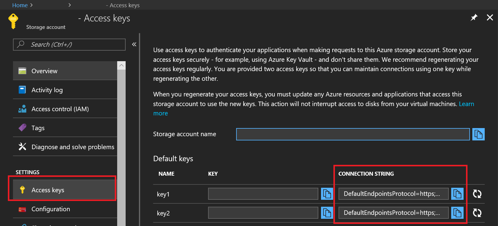

# Azure Storage SDK for Unity

[!include[](../../includes/header.md)]

> [!IMPORTANT]
> This is an experimental Unity SDK for Azure Storage.  As such, please note that this SDK is not supported and is not provided by the Azure Storage team.  If you run into problems, please let us know using the [GitHub Issues](https://github.com/BrianPeek/azure-storage-net/issues) page for this fork.

[](https://github.com/BrianPeek/azure-storage-net/tree/gamedev)
[](https://aka.ms/azstorage-unitysdk)

## Requirements

* [Unity 2017.1 (or greater)](https://unity3d.com/)
  * Unity 2017.1 includes a new scripting runtime that supports .NET 4.6.  This feature allows us to use the existing Azure SDKs with some tweaks.  Please see [this blog post from Unity](https://blogs.unity3d.com/2017/07/11/introducing-unity-2017/) for more information.
* [An Azure Storage account (Sign up for free!)](https://aka.ms/azfreegamedev)

## Compatibility

This has been tested with the following Unity exporters.  Others may work -- we haven't tested every platform, so please let us know if you've had success!

* Windows standalone
* UWP (.NET)
* iOS
* Android (Mono)
* Unity editor

## Known Issues and Limitations

There are a few known issues and workarounds.

### Unity and SSL support

Due to a Unity limitation, HTTPS requests using the standard .NET networking stack (i.e. not using UnityWebRequest) will fail.  To workaround this, you will need to modify the **DefaultEndpointsProtocol** entry in your connection string to use **http** instead of **https**.  **This means your data will not be encrypted to and from the server.**  Here's an example:

```text
DefaultEndpointsProtocol=http;AccountName=yourazureaccount;AccountKey=abcdef12345;EndpointSuffix=core.windows.net
```

[!include[](include/uwp-known-issues.md)]

### Other Platforms

We have not had success in compiling or running games using the following platforms:

* Android (IL2CPP)
* UWP (IL2CPP)
* WebGL

We will continue working on these and update as we find fixes.

## Import the SDK

To import the SDK into your own project, make sure you have downloaded the latest [.unitypackage](https://aka.ms/azstorage-unitysdk) from GitHub.  Then, do the following:

[!include[](include/unity-import.md)]

Please refer to the [Azure Storage Docs](https://aka.ms/azstoragedocsgamedev) for even more samples and tutorials on using the API.

## Try the Sample

To use the sample, you will need to have an Azure Storage account setup along with a valid connection string.  You can learn more about that [here](https://docs.microsoft.com/en-us/azure/storage/common/storage-create-storage-account).

To use the sample, do the following:

1. Download the [Unity SDKs repo](https://github.com/BrianPeek/AzureSDKs-Unity) from GitHub (or import it from the .unitypackage and continue to step 4).

1. Unzip to a location on your hard drive.

1. Open Unity 2017.1 (or greater) and point it to the **Storage** directory inside the unzipped package.

1. In the **Project** window, double-click the **AzureSample** scene inside the **AzureSamples\Storage** directory to open the main scene for the sample.

1. In this scene, select the **StorageObject** item in the **Hierarchy** window.

1. With **StorageObject** selected, you'll notice that there are blank **Connection String** entries in the **Inspector** window.  Fill in the these entries with your valid connection string as shown on the Azure portal, but remember to change the endpoint to use **http** as described above.  You can change the names of the other items if you wish, but the defaults should work as-is. You can find your connection strings in the Azure Portal as shown.

   

1. Run the project from within the editor by clicking the **Play** button.  Alternatively, you can export to the platform of your choosing and run there.

1. At this point, you can click the button for any of the four storage types and watch the output window.  If things are setup and working, you will see the sample test a standard workflow.

The code for the sample is broken out into four separate scripts, one for each storage type.  Take a look at each to learn more about how it works.

## Next Steps

* [Azure Storage Docs](https://aka.ms/azstoragedocsgamedev)
