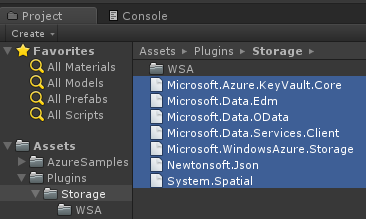
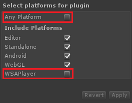

# Azure Storage SDK for Unity

[!include[](../../includes/header.md)]

This is an experimental Unity SDK for Azure Storage.

> [!IMPORTANT]
> As stated above, please note that this SDK is not supported and is not provided by the Azure Storage team.  If you run into problems, please let us know using the [GitHub Issues](https://github.com/BrianPeek/azure-storage-net/issues) page for this fork.

[](https://github.com/BrianPeek/azure-storage-net)
[](https://github.com/BrianPeek/azure-storage-net/releases)

## Requirements

* [Unity 2017.1 (or greater)](https://unity3d.com/)
* [An Azure Storage account (Sign up for free!)](https://azure.microsoft.com/en-us/free/)

## Compatibility

This has been tested with the following Unity exporters.  Others may work, and we haven't tested every platform, so please let us know if you've had success!

* Windows standalone
* UWP (.NET)
* iOS (IL2CPP)
* Android (Mono)
* Unity editor

## Known Issues and Limitations

There are a few known issues and workarounds.

### Unity and SSL support

Due to a Unity limitation, HTTPS requests using the standard .NET networking stack (i.e. not using UnityWebRequest) will fail.  To workaround this, you can modify the the **DefaultEndpointsProtocol** entry in your connection string to use **http** instead of **https**.  Here's an example:

```text
DefaultEndpointsProtocol=http;AccountName=yourazureaccount;AccountKey=abcdef12345;EndpointSuffix=core.windows.net
```

### UWP Builds

To build for UWP, ensure that the the DLLs in the root Plugins directory are excluded from the build, while the DLLs in the WSA directory are included in the build.  To do this:

1. In the **Project** window, select all DLLs that are in the **Plugins** directory
   
1. In the Inspector window at the right, make sure only **WSAPlayer** is selected and **Any Platform** is not selected
   

With these selections, you should be able to export your UWP build without issue.  To go back to building for another platform, reverse the process -- make sure both **Any Platform** and **WSAPlayer** are selected and then export.



### Other Platforms

We have not had success in compiling or running games using the following platforms:

* Android (IL2CPP)
* UWP (IL2CPP)

We will continue working on these and update as we find fixes.

## Import the SDK

1. Download the latest [.unitypackage](https://github.com/BrianPeek/azure-storage-net/releases) from GitHub.
1. Open Unity and select **Edit > Project Settings > Player** to open the **PlayerSettings** panel.
1. Select **Experimental (.NET 4.6 Equivalent)** from the **Scripting Runtime Version** dropdown in the **Configuration** section.

   
1. Add the .unitypackage you downloaded in the first step to Unity by using the **Assets > Import Package > Custom Package** menu option.
1. In the **Import Unity Package** box that pops up, you can select which things you'd like to import.  By default everything will be selected.  If you don't wish to explore the sample, you may uncheck the **Sample** and **StreamingAssets** directories.
1. Click the **Import** button to add the items to your project.

With the package added, you can now use the Azure Storage SDK API in your scripts as you would in any other application.  Please take a look at the included sample which demonstrates how to use each of the storage services to perform simple tasks. Also, please refer to the [Azure Storage Docs](https://docs.microsoft.com/azure/storage/) for even more samples and tutorials.

## Try the Sample

To use the sample, you will need to have an Azure Storage account setup along with a valid connection string.  You can learn more about that [here](https://docs.microsoft.com/en-us/azure/storage/common/storage-create-storage-account).

To use the sample, do the following:

1. Download the [sample project](https://github.com/BrianPeek/azure-storage-net/releases/tag/v8.5.0unity) from GitHub.
1. Unzip to a location on your hard drive.
1. Open Unity 2017.1 (or greater) and point it to the project you just unzipped.
1. Down in the **Project** window, double-click the **AzureSample** scene inside the **Sample** directory to open the main scene for the sample.
1. In this scene, select the **StorageObject** item in the **Hierarchy** window.
1. With **StorageObject** selected, you'll notice that there are blank **Connection String** entries in the **Inspector** window.  Fill in the these entries with your valid connection string as shown on the Azure portal.  You can change the names of the other items if you wish, but the defaults should work as-is.
1. Run the project from within the editor by clicking the **Play** button.  Alternatively, you can export to the platform of your choosing and run there.
1. At this point, you can click the button for any of the four storage types and watch the output window.  If things are setup and working, you will see the sample test a standard workflow.

The code for the sample is broken out into for separate scripts, one for each storage type.  Take a look at each to learn more about how it works.

## Next Steps

* [Azure Storage Docs](https://docs.microsoft.com/azure/storage/)
