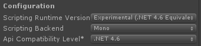

1. Open Unity and select **Edit > Project Settings > Player** to open the **PlayerSettings** panel.

1. Select **Experimental (.NET 4.6 Equivalent)** from the **Scripting Runtime Version** dropdown in the **Configuration** section.

   

1. Add the .unitypackage you downloaded in the first step to Unity by using the **Assets > Import Package > Custom Package** menu option.

1. In the **Import Unity Package** box that pops up, you can select which things you'd like to import.  By default everything will be selected.  If you don't care to use the sample, you can uncheck that box.

1. Click the **Import** button to add the items to your project.

With the package added, you can now use the normal API in your scripts as you would in any other application.  Please take a look at the corresponding [sample](https://github.com/BrianPeek/AzureSDKs-Unity) (also included in each .unitypackage) which demonstrates how to use each of the services to perform simple tasks.
