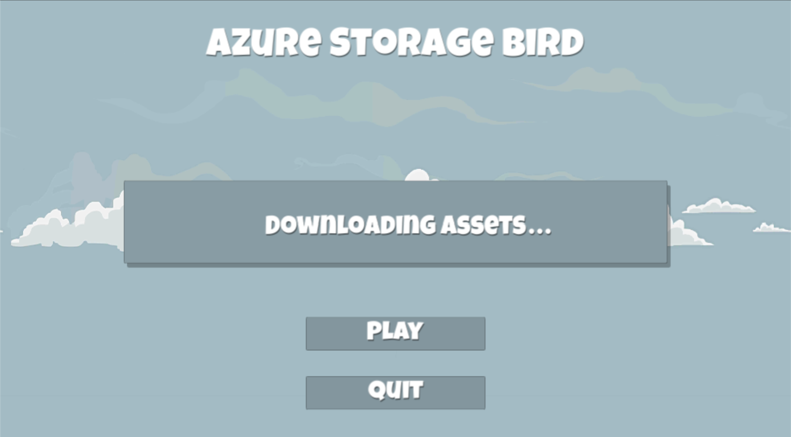
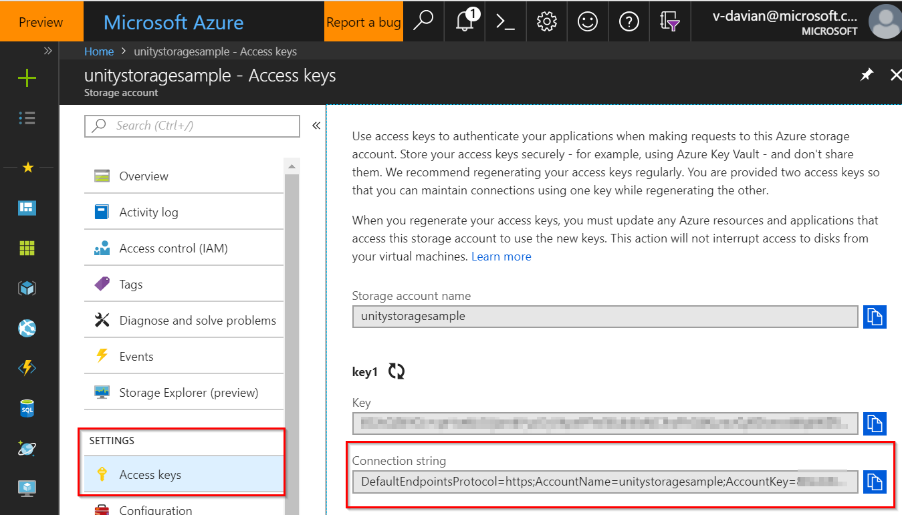

# Azure Storage Bird

[!include]

## Introduction

This sample game project demonstrates downloading files at runtime from Azure Storage using the [Azure Storage SDK for Unity]( https://aka.ms/azstoragegamedev). This is useful for reducing the initial download size of your app. This approach could be adapted for a variety of purposes, such as updating game content without rebuilding and resubmitting the game, or adding new content to a live game.

Because music files typically are among the largest data files in games, the sample game has been designed to leverage several music assets. As the player progresses in the game, the background music changes, providing a good use case for downloading assets at runtime with the Azure Storage SDK.

## Requirements

* [Unity 2017.1 (or greater)](https://unity3d.com/)
  * Unity 2017.1 includes a new scripting runtime that supports .NET 4.6. This feature allows use of the existing Azure SDKs with some tweaks.  Please see [this blog post from Unity](https://blogs.unity3d.com/2017/07/11/introducing-unity-2017/) for more information.
* [An Azure subscription (create for free!)](https://aka.ms/azfreegamedev)

> [!NOTE]
> This project requires the "experimental" .NET 4.6 Mono scripting runtime in Unity 2017. [Unity has stated that soon this will be the default](https://forum.unity3d.com/threads/future-plans-for-the-mono-runtime-upgrade.464327/), however for now, it is still labeled as "experimental" and you may experience issues.
>
> Additionally, the Azure Storage SDK for Unity is considered experimental. As such, this may not build and run on every single Unity platform.  Please see the Azure Storage SDK [compatibility list](https://docs.microsoft.com/en-us/sandbox/gamedev/unity/azure-storage-unity#compatibility) for a list of known working platforms and issues.

## Azure setup

1. [Create an Azure Storage account](https://docs.microsoft.com/en-us/azure/storage/common/storage-quickstart-create-account?tabs=portal).

1. [Create a container](https://docs.microsoft.com/en-us/azure/storage/blobs/storage-quickstart-blobs-portal#create-a-container) called `music`.

1. Download the [sample music files](https://github.com/BrianPeek/AzureSamples-Unity/blob/master/AzureStorageBird/Metal%20Mayhem%20Music%20Pack.zip), unzip them, and [upload them to Azure Storage as block blobs](https://docs.microsoft.com/en-us/azure/storage/blobs/storage-quickstart-blobs-portal#upload-a-block-blob). These music files are from the free [Metal Mayhem Music Pack](https://assetstore.unity.com/packages/audio/music/metal-mayhem-music-pack-19233) made available by Unity.

> [!NOTE]
> The sample project is hard coded to look in a block blob container called `music` and use the specific file names included in the sample music zip file (`Track1.ogg` through `Track10.ogg`). If you use differently named files, or only upload some of the files, you will need to modify the sample project's code accordingly.

## Download the sample Unity project

Clone or download the project from the [AzureSamples-Unity repository](https://aka.ms/azsamples-unity) on GitHub.

* On the GitHub site, click the **Clone or download** button to get a copy of the project to work with.
* This project is located within the `AzureStorageBird` directory.

> [!NOTE]
> The project comes with the Azure Storage for Unity SDK included. To learn more, including how to import the SDK into new projects, you can visit the [SDK documentation](https://aka.ms/azstoragegamedev).

## Set scripting runtime version to .NET 4.6 equivalent

The Azure Storage for Unity SDK requires the .NET 4.6 equivalent scripting runtime. This is only available in Unity 2017.1 and above.

1. From the Unity menu select **Edit > Project Settings > Player** to open the **PlayerSettings** panel.

1. Select **Experimental (.NET 4.6 Equivalent)** from the **Scripting Runtime Version** dropdown in the **Configuration** section. Unity will prompt you to restart the editor.

   

## Enter your connection string

1. Log in to the [Azure portal](http://portal.azure.com).

1. Navigate to the Azure Storage account that you created for use with this sample.

1. In the **Settings** section of the left-side menu, select **Access keys**.

1. Copy the entire **Connection string**.

1. In the Unity sample project, open the file `AzureStorageClient.cs`.

1. Replace the string `YOUR_CONNECTION_STRING_HERE` with your connection string copied from the Azure portal.

1. Within the connection string you just pasted, locate the text `DefaultEndpointsProtocol=https` and replace the text **https** with **http**.

> [!IMPORTANT]
> You must modify the **DefaultEndpointsProtocol** entry in your connection string to use **http** instead of **https**. This means your data will not be encrypted to and from the server. Visit the [Unity and SSL support](https://docs.microsoft.com/en-us/sandbox/gamedev/unity/azure-storage-unity#unity-and-ssl-support) section of the SDK documentation for more information.

## Try the sample game

1. Build and run on a supported platform or open the **Title Scene** in the editor and click the **play** button.

1. When the game starts, if any required assets are missing, a "Downloading assets..." dialog should appear. Wait for the game to finish downloading the required assets from your Azure Storage account.

1. Once the download completes, the dialog should clear. Press the **Play** button.

1. In the main game scene, click the left mouse button or tap the screen to "flap." Navigating through the columns earns points. Each time you earn five points, the background music should change to a new song downloaded from Azure storage.

## Sample game explanation

### Gameplay

The sample game gameplay is based on the [Make a Flappy Bird Style Game](https://unity3d.com/learn/tutorials/topics/2d-game-creation/project-goals?playlist=17093) Unity tutorial series. It has been modified to download music assets from Azure Storage and play new music each time the player reaches a new level by accumulating a specified amount of points.

### AzureStorageClient.cs

The static class [`AzureStorageClient`](https://github.com/BrianPeek/AzureSamples-Unity/blob/master/AzureStorageBird/Assets/Azure%20Storage%20Bird%20Sample%20Assets/Scripts/AzureStorageClient.cs) holds the Azure Storage account connection string and contains a static reference to a [`CloudBlobClient`](https://docs.microsoft.com/en-us/dotnet/api/microsoft.windowsazure.storage.blob.cloudblobclient?view=azure-dotnet), which is necessary for most Azure Storage functions.

### TitleSceneBehavior.cs

The MonoBehaviour [`TitleSceneBehavior`](https://github.com/BrianPeek/AzureSamples-Unity/blob/master/AzureStorageBird/Assets/Azure%20Storage%20Bird%20Sample%20Assets/Scripts/TitleSceneBehavior.cs) is placed on an empty GameObject in the Title Scene. Its `Start` function asynchronously initiates the process of checking for the required music files and downloading them from Azure Storage if necessary. The play button is disabled until the required files are first downloaded and then loaded as audio clips.

### BlobStorageUtilities.cs

The static class [`BlobStorageUtilities`](https://github.com/BrianPeek/AzureSamples-Unity/blob/master/AzureStorageBird/Assets/Azure%20Storage%20Bird%20Sample%20Assets/Scripts/BlobStorageUtilities.cs) contains functions for downloading files from Azure Blob Storage.

### LevelMusicPlayer.cs

The MonoBehaviour [`LevelMusicPlayer`](https://github.com/BrianPeek/AzureSamples-Unity/blob/master/AzureStorageBird/Assets/Azure%20Storage%20Bird%20Sample%20Assets/Scripts/LevelMusicPlayer.cs) is placed on an empty GameObject in the Title Scene and persists via `DontDestroyOnLoad`. During the Title Scene, it waits for the `TitleSceneBehavior.DownloadingMusicFilesFinished` event and then begins loading all of the downloaded files as Unity audio clips. This happens before entering the Game Scene in order to avoid stuttering when each new audio clip is played. Once loading is complete, the `LoadingAudioClipsFinished` event is raised, allowing `TitleSceneBehavior` to know when it's safe to display the play button.

During the Game Scene, `LevelMusicPlayer` handles the `GameControl.StartedNewLevel` event with a function that plays an audio clip corresponding to the new level.