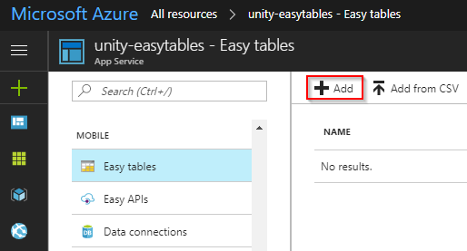

### Create a new Azure Mobile App

Log in to the [Azure portal](https://ms.portal.azure.com). If you do not have an Azure subscription, the [free trial](https://aka.ms/azft-gaming) or included credits from [Visual Studio Dev Essentials](https://www.visualstudio.com/dev-essentials/) will more than suffice for completing this walkthrough.

**Once inside the portal:**

1. Select **New > Web + Mobile > Mobile App > Create**.

  

1. Configure the new Mobile App:
   Setting | Description
   --- | ---
   **App Name** | This will be used to create the URL for connecting to the Azure Mobile App backend. You must choose a unique name, indicated by the green checkmark.
   **Subscription** | Choose the subscription the new Mobile App will use for billing.
   **Resource Group** | Resource groups allow easier management of related resources. By default Azure creates a new resource group with the same name as the new app. The default setting works well for the walkthrough.
   **App Service Plan/Location** | The service plan dictates the computing power, location, and cost of the resources Azure uses to host your new Mobile App. By default Azure will create a new service plan with some default settings. This is the simplest option for this walkthrough. However, you can use this menu to customize a new service plan's pricing tier or geographic location. Additionally, settings for a service plan can be modified after deploying it.

   

1. Click **Create** and give Azure a few minutes to deploy the new resource. You will see a notification in the Azure Portal when deployment has completed.

### Add a new data connection

1. Once deployment has completed, click the **All resources** button and then select the newly created Mobile App.

   

1. In the newly opened blade, scroll down in the left side-menu and click the **Easy Tables** button, listed under the **MOBILE** heading.

   

1. Click the blue **Need to configure Easy Tables/Easy APIs** notice displaying along the top of the Easy Tables blade on the right side of the screen.

   

1. Click the notice that says **You need a database to use Easy Tables. Click here to create one**.

   

1. On the Data Connections blade, click the **Add** button.

   

1. On the Add a data connection blade, select **SQL Database**.

   

1. A blade will open for configuring a new SQL database and SQL server:
   * **Name:** Enter a name for the database.
   * **Target server:** Click **Target server** to open the New server blade.
     * **Server name:** Enter a name for the server.
     * **Server admin login and Password:** Create a username and password for the server admin.
     * **Location:** Choose a nearby location for the server.
     * Ensure that the **Allow azure services to access server** checkbox remains checked.
     * Click **Select** to complete configuration the server.
   * **Pricing tier:** Leave the default setting for the walkthrough. This can be modified later.
   * **Collation:** Leave the default setting.
   * Click **Select** to complete configuration of the database.

   

1. Back at the Add data connection blade, click **Connection String**. When the Connection string blade appears, leave the default settings and click **OK**.

   

1. Back at the Add data connection blade, the text **MS_TableConnectionString** should no longer be in italics. Click **OK** and give Azure a few minutes to create the new data connection. A notification will arrive when the process is complete.

   

### Complete the Easy Table initialization

1. Once the new data connection has been created successfully, click the **All resources** button, and again navigate back to the Mobile App. It is important to complete this step to refresh the Easy Table configuration notice.

1. Scroll down and select **Easy Tables**, and once more select the blue **Need to configure Easy Tables/Easy APIs** notice.

   

1. This time the blade that appears should state that "You already have a data connection" below the **1** heading. Under the **2** heading, click the checkbox that says **I acknowledge that this will overwrite site contents.** Now click **Initialize App** and wait a few minutes for Azure to complete the initialization process. A new notification will announce when the process is complete.

   

## Create Easy Tables

Now that you have a Mobile App on Azure with Easy Tables initialized, it's time to build the tables that will keep track of data sent from a Unity game.

### Setup the crash heatmap table

1. In the Azure portal, click **All resources** and then select the Mobile App that you configured for Easy Tables in the previous steps.

   

1. Scroll down to the **Mobile** heading and select **Easy Tables**. There should no longer be any notice about initializing your app for Easy Tables.

   

1. Click the **Add** button in the Easy Tables blade on the right side of the screen.

   

1. Name the table "**CrashInfo**" and click **OK**. Leave the rest of the options with their default settings.

   

1. A notification will announce when the new table has been created.

> [!NOTE]
> With Easy Tables, the table schema is actually dynamically created as data is added. This means appropriate data columns do not have to be manually set up during this step.

### Setup the leaderboard table

1. Go back to the Easy Tables blade and click **Add** to add a second table.

   

1. Name the new table "**HighScoreInfo**" and click **OK**. Leave the rest of the options at their default settings.

   

1. A notification will announce when the new table has been created.