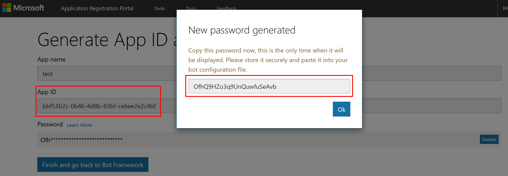
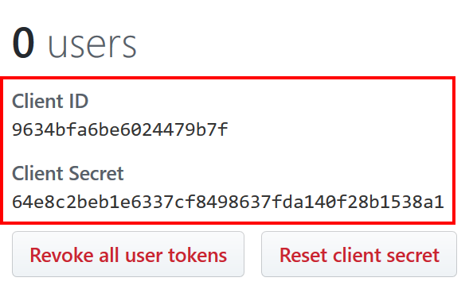
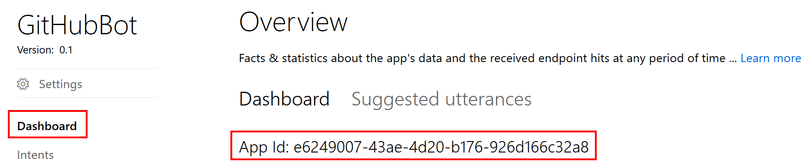
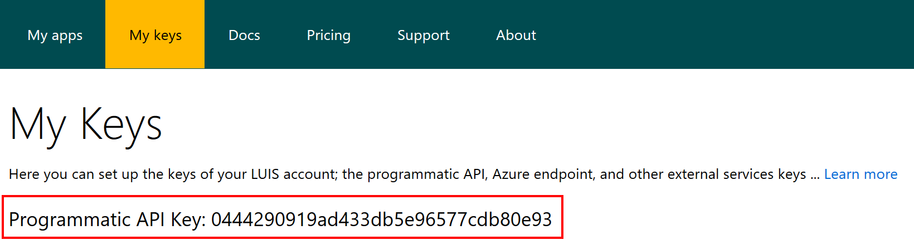
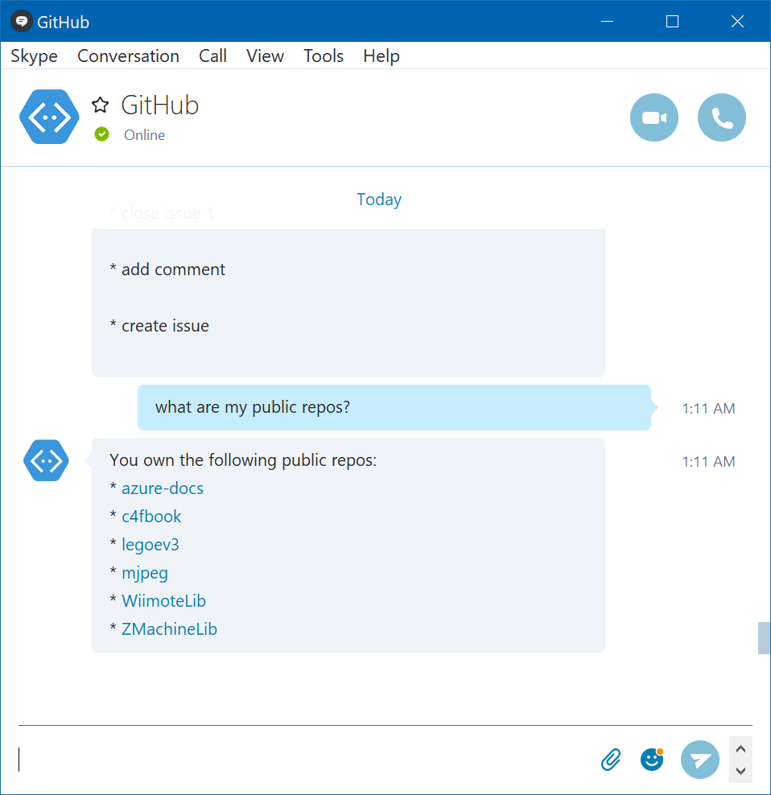

[!include[](includes/header.md)]

# GitHubBot
[GitHubBot](https://github.com/BrianPeek/GitHubBot) is a chat bot that lets you manage your GitHub repos and issues from a chat window.  This project is written in C# using the [Bot Framework](https://dev.botframework.com), [LUIS.ai](https://luis.ai), and [Octokit.NET](https://github.com/octokit/octokit.net).

[](https://azuredeploy.net/?repository=https://github.com/BrianPeek/GitHubBot)

## Requirements
* An [Azure](https://azure.microsoft.com/en-us/free/) account
* A [GitHub](https://github.com/) account

## Links
* [GitHubBot Repo](https://github.com/BrianPeek/GitHubBot)

## Configuration
Setting this bot up for your own use is a bit tricky as there many parts.  However, if you follow this guide closely, and in the order specified, you should be able to get this running yourself.

### Azure Deployment
1. Click the [Deploy to Azure](http://azuredeploy.net/?repository=https://github.com/BrianPeek/GitHubBot) link here or the button above.
1. Enter the information for your Azure subscription, such as the resource group, location, etc. and give your site a unique Site Name.  This site name will become part of the URL.
1. Copy down the URL to your web application, which will be https://&lt;sitename&gt;.azurewebsites.net .


The application will be deployed and the GitHub repo above will be setup in the App Service as the deployment source.  We'll come back to the portal later to enter some keys that you will generate below.

### Bot Registration
1. Browse to the Bot Framework portal and register a new bot by navigating to [https://dev.botframework.com/bots/new](https://dev.botframework.com/bots/new), logging in and/or creating an account if necessary.
1. Enter a name and handle in the **Bot profile** section.
1. In the **Configuration** section, do the following:
   1. Enter the messaging endpoint -- assuming you deployed your app to the default location, this will take the form of https://&lt;sitename&gt;.azurewebsites.net/api/messages .
   1. Click the **Create Microsoft App ID and password** button and login if requested.
   1. Copy the **App ID** field somewhere safe as you will need it later. [1]
   1. Click the **Generate an app password to continue** button, and copy the generated password as you will need it later (and you cannot view it again). [2]
      * **Note:** The App ID can be viewed later on from the Bot Framework portal, however the password is only displayed this one time. If you lose it, you will have to generate a new password.
   1. Click the **Finish and go back to Bot Framework** button.
      
1. Scroll down, check the "terms of use" checkbox, and then click the **Register** button.

### GitHub Application Setup
1. Browse to the **OAuth applications** section of your profile on GitHub by navigating to [https://github.com/settings/developers](https://github.com/settings/developers), logging in if necessary.
1. Click the **Register a new application** button at the top right of the page.
1. Enter the required information.  The one that really matters is **Authorization callback URL**.  This is the URL to the OAuth handler for GitHubBot, and if you deployed the app using the instructions above, it will take the form of **https://&lt;sitename&gt;.azurewebsites.net/api/OAuthCallback**. [3]
1. Click the **Register application** button.
1. After the app is created, you will be presented wtih a **Client ID** and **Client Secret**.  Copy these somewhere safe as you'll need them later. [4]  If you lose them, you can always browse back to the link above and view your application and change its configuration.



### LUIS.ai
The root directory of the linked repo contains a file named **GitHubBot.json**. This file contains the model for the bot.  To use it, do the following:
1. Download this file or clone the whole [GitHubBot repo](https://github.com/BrianPeek/GitHubBot).
1. Sign into the [LUIS.ai](https://luis.ai) website, creating an account if necessary.
1. Click the **My apps** tab.
1. Click the **Import App** button.
1. Click the **Browse...** button and select the **GitHubBot.json** file.
1. Optionally, give the app a new name, otherwise it will use the default name of **GitHubBot** from the model you just uploaded.
1. Click the **Import** button.
1. After the app is imported, copy down the **App Id** found on the **Dashboard** tab. [5]
   
1. Click the **My keys** tab and copy the **Programmatic API Key** which is good for 1000 endpoint hits per month. [6] This key is just for testing, and you can [setup a production key](https://docs.microsoft.com/azure/cognitive-services/luis/azureibizasubscription) later.
   
   * These keys are always accessible from the LUIS.ai site later on.

1. Click the **My apps** tab and select the bot you just created from the list.
1. Click the **Publish app** selection in the left navbar.
1. Select the default **Endpoint Key** in the dropdown box (or one you purchased).
1. Click the **Train** button.
1. When training is complete, click the **Publish** button.
   

### App Service Configuration
1. Browse back to the [Azure portal](https://portal.azure.com/) and login.
1. Open the App Service that you deployed above.
1. Click the **Application settings** entry in the **Settings** section in the left panel.
1. Add the following entries to the **App settings** section and then click the **Save** button:

Key | Value
----|------
MicrosoftAppId       | The App Id copied from the Bot Registration step [1]
MicrosoftAppPassword | The generated password copied from the Bot Registration step [2]
RedirectUri          | The OAuthCallback handler, which must match the URL you used when you created the OAuth Application on GitHub [3]
GitHubClientId       | The ID generated by GitHub when you created the OAuth Application [4]
GitHubClientSecret   | The secret generated by GitHub when you created the OAuth Application [4]
LuisModelId          | The ID genreated by LUIS.ai [5]
LuisSubscriptionKey  | The ID generated by LUIS.ai [6]


## How to Run
Head back to the [Bot Framework portal](https://dev.botframework.com/bots/) and click on the bot you just created.  Then, to interact with the bot:
* Click the Test button at the top right to communicate with the bot in your browser
* Click the Skype link to add the bot to your Skype contact list
* Add additional channels and communicate through those apps
* Type **help** at the bot to get more information, or **login** to log into GitHub with the bot.



## How it Works
There are a lot of parts here -- let's talk about some of the important ones:

### OctoKit
[OctoKit.NET](https://octokit.github.io/) is a library that wraps the GitHub REST API for .NET developers.  This handles OAuth in addition to all of the GitHub calls we need.  To use this in your own projects, just search for OctoKit in the NuGet package manager and install.  The API itself is quite simple.  Once you complete the OAuth procedure on behalf of the user, you'll be handed a token that is used for each subsequent query (or, you can use the library anonymously to query public GitHub information).  The library handles much more than repos and issues, but that's all this demo is currently using.

### OAuth
OAuth is required to authenticate a user against the GitHub API.  OctoKit.NET handles most of the messiness of OAuth, but we still need to do a few things ourselves, especially as it relates to the Bot Framework.  When the OAuth process is initiated, OctoKit.NET calls a specific endpoint at GitHub with some state data we pass along.  Part of this data is a serialized `ConversationReference` object.  The OAuth procedure will hand this serialized state back to us after the user logs in, and we then use this to spin the conversation back up with the user and continue. This makes the login procedure seamless.

### LUIS.ai training
I have included a pre-trained model with intents for this project.  You can and should monitor/train this model as you use it.  A few notes about the model:
* It contains 9 intents which map to the "commands" the chat bot can handle.  Check the **Intents** tab in the left navbar to see them all and how they were trained.
* It contains several custom entities that make parsing the query possible.  These include the **ScopeType** (private or public for repositories), and **RepoName**.
* The model also uses two prebuilt entities: **datetimeV2** and **number**.  **DatetimeV2** is interesting in that a user can say something like "What are my new issues since last Friday" and LUIS will convert "last Friday" into the actual dateime for "last Friday" so you don't need to do the math yourself.  There are a lot more prebuilt entties, see the [docs](https://docs.microsoft.com/azure/cognitive-services/luis/pre-builtentities) for more information.
* The model contains two phrase lists to help LUIS understand GitHub-specific terms like repossitory, gist, pull request, etc.  You can find those in the **Features** tab in the left navbar.

### GitHubLuisDialog
LuisDialog is the class used by the Bot Framework to work with LUIS results.  Methods in this class are tagged with the **LuisIntent** attribute and the intent it maps to.  So, when LUIS determines the user is requesting the **CloseIssue** intent, for example, the `CloseIssue` method in this class is tagged with that intent and will be call automatically through the Bot Framework.

```csharp
[LuisIntent("CloseIssue")]
public async Task CloseIssue(IDialogContext context, LuisResult result)
```

The LUIS service is mapped to our class in the first few lines of the Message handler in MessageController.cs.

```csharp
LuisModelAttribute attr = new LuisModelAttribute(ConfigurationManager.AppSettings[Constants.LuisModelIdKey], ConfigurationManager.AppSettings[Constants.LuisSubscriptionKey]);
LuisService luisSvc = new LuisService(attr);
await Conversation.SendAsync(activity, () => new GitHubLuisDialog(luisSvc));
```

## Next Steps

Here are links to the docs for the items discussed above.  Play around with the project and feel free to leave comments on the article, [open issues](https://github.com/BrianPeek/GitHubBot/issues) in the repo, or submit [pull requests](https://github.com/BrianPeek/GitHubBot/pulls) with fixes and new features.  Enjoy!

* [Bot Framework Docs](https://docs.microsoft.com/bot-framework)
* [LUIS.ai Docs](https://docs.microsoft.com/en-us/azure/cognitive-services/LUIS/Home)
* [OctoKit.NET](https://octokit.github.io/)
