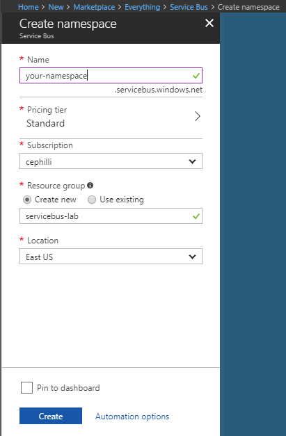
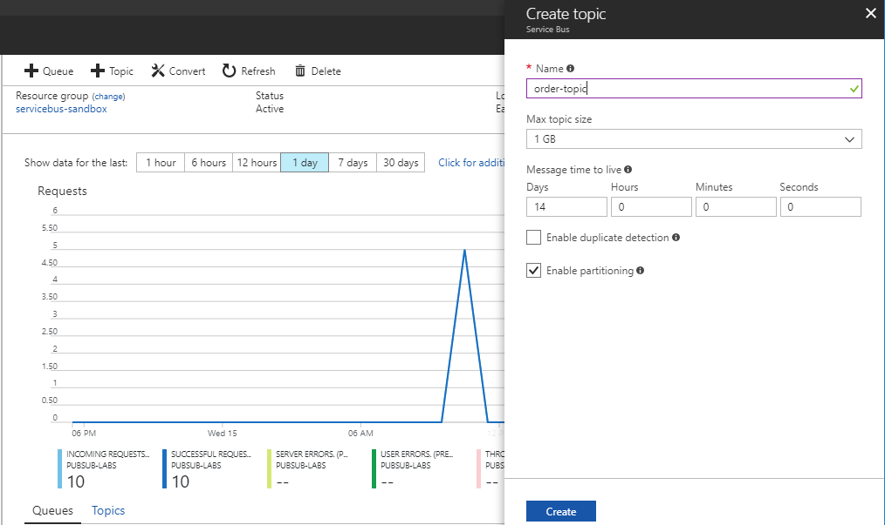
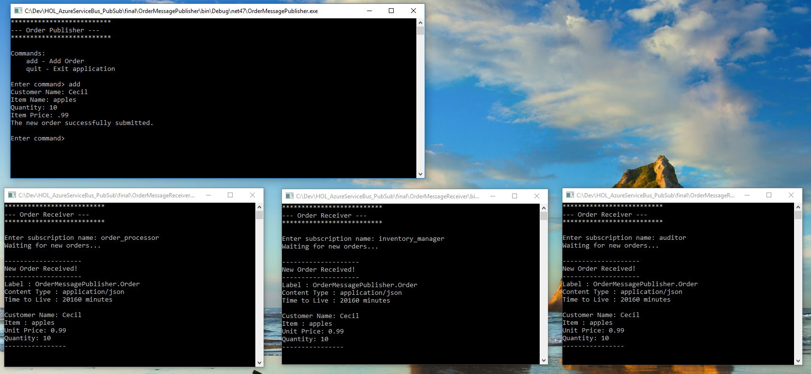

# Implementing Publish-Subscribe with Azure Service Bus and the .NET Framework

[!include[](../includes/header.md)]

## Introduction
Azure Service Bus is a hosted messaging service that enables reliable and secure communication at cloud scale. 
The main goal of the service is to make it easier to exchange information by acting as the message broker. The producers and consumers of messages
 know little about each other by design. Instead of communicating directly with each other, all communication is mediated through
the broker. This type of brokered messaging is sometimes described as temporal decoupling, since neither side is required to be online at the same time.
This flexibility makes it relatively easy to implement messaging patterns such as Publish-Subscribe.

The brokered messaging support in Azure Service Bus is formed around two entities; queues and topics. Queues offer First-in First-out (FIFO)
message delivery to one or more competing consumers. Therefore, messages are retrieved and processed by consumers in the order
they were added to the queue. Also, each message is received and processed by only a single message consumer. Alternatively, topics provide a one-to-many form of messaging. Messages sent to topics are delivered to one or more associated subscriptions, which may have optional
filters applied to restrict the incoming messages. Unlike queues, producers send messages to topics but consumers receive messages from subscriptions to the topics.

In this lab, you walk through the process of implementing the Publish-Subscribe pattern in Azure Service Bus using topics. You create producers and consumer(s) using C#, the [.NET Framework](https://www.microsoft.com/net/download/windows) and the [Azure Service Bus .NET Client](https://www.nuget.org/packages/WindowsAzure.ServiceBus). By the end of this lab, you should feel comfortable with creating Azure Service Bus namespaces. You will also learn about sending and retrieving messages to topics, and moving troublesome messages to the dead-letter queue.

The lab also assumes that you are using the [Visual Studio IDE](https://www.visualstudio.com/vs) on Windows. Also, you should have already signed up for a [Microsoft Azure account](https://azure.microsoft.com/en-us/free). Included with this lab, you will find a starter solution in the **start** folder, which has the basic setup required for you to get started. Also,
if you ever get stuck, feel free to review the completed solution inside of the **final** folder.

<a name="Exercises"></a>
## Exercises
This workshop consists of the following exercises:

1. [Create a namespace](#Exercise1)
2. [Create a topic](#Exercise2)
3. [Add shared access signatures](#Exercise3)
4. [Create the publisher](#Exercise4)
5. [Create the subscriber](#Exercise5)
6. [Send your first message](#Exercise6)
7. [Handle unsupported messages with the dead-letter queue](#Exercise7)

<a name="Exercise1" ></a>
## 1. Create a namespace 
Before you can create topics or queues in Azure Service Bus, first you have to create a namespace. Namespaces are containers that are used to
scope your messaging components. Within a namespace, you can create a many topics or queues as you need.

### Steps

1. Go to the [Azure portal](https://portal.azure.com), and sign in with your account.
2. In the left navigation, click **New** to open up the market place.
3. Now choose **Enterprise Integration** and then **Service Bus**
4. When the **Create namespace** sections opens, enter a name for your namespace.
5. Next, choose the Azure subscription and resource group you want use.
6. Click the **Create** button. Your new namespace should be ready within a minute or so.




<a name="Exercise2" ></a>
## 2. Create a topic
There are a variety of ways you can create topics for Azure Service Bus. Powershell Cmdlets, management SDKs for variously languages, and the UI
inside of the Azure portal are all viable options. In this lab, we will create topics using the Azure portal UI.

### Steps
1. Go to your newly created namespace. Make sure you are in the **Overview** section.
2. Click on the **Topic** button in the horizontal menu. This should open the **Create topic** section.
3. Enter a name for your topic. In the screenshot below, I choose *order-topic* since we're going to be working with orders. The other options can be left with their default values.
4. Click the **Create** button to provision your topic.




<a name="Exercise3" ></a>
## 3. Add shared access signatures
[Share Access Signatures](https://docs.microsoft.com/azure/service-bus-messaging/service-bus-sas) (or SAS keys)
is a way to control who has access to your Service Bus instance. SAS keys in
Service Bus are SHA-256 secure hashes, and are paired with Shared Access policies.
Together, they enable applications to be authorized on the namespace level or on the individual queue/topic with specific permissions. The available permissions today are:
* Send
* Listen
* Manage 

By default, every Service Bus namespace has a root policy created that has all permissions enabled. Now, you will create two polices; one for the publishing side and another for the subscription side.

### Steps
1. In your Service Bus instance inside the Azure portal, select the **Shared access policies** section in the left menu.
2. Click on the **Add** button in the Shared access policies section.
3. Enter **SenderPolicy** in the text box and only select the **Send** permissions.
4. Click the **Create** button to add this policy to your namespace.
5. Add a second policy. Give it a name of **ReceiverPolicy** and only select the **Listen** permission.
6. After creating the policies, click on one of them in the list. 
You should now see a pair of SAS keys as well as their associated connection strings. We will use these shortly.


<a name="Exercise4" ></a>
## 4. Create the publisher
In this lab, you will create a basic Publish-Subscribe system around placing orders. If you haven't already done so, open the folder that contains the resources for this lab. Navigate into the **start** folder and open the **HOL_AzureServiceBus_PubSub_Starter.sln** file in Visual Studio. Now we're going to create a console application for publishing orders.

### Steps
1. Navigate to the **OrderMessagePublisher** project.
2. Right click on the project, and choose **Manage NuGet packages**. The two packages you'll need to install are
[Microsoft.Extensions.Configuration.Json](https://www.nuget.org/packages/Microsoft.Extensions.Configuration.Json)
and [WindowsAzure.ServiceBus](https://www.nuget.org/packages/WindowsAzure.ServiceBus).
3. Open the **appsettings.json** file. This is where the configuration information is being stored. You should see a section
for ServicebusConifg containing placeholders for TopicName and ConnectionString.
4. Copy and paste the connection string for the **SenderPolicy** policy next to ConnectionString key, and also enter the name of your topic next to the TopiceName key.
5. Open the **ServicebusPublisher.cs** file.
6. First you will implement the constructor. To send messages to a topic in Azure Service Bus, you will need an instance of the [TopicClient](https://docs.microsoft.com/dotnet/api/microsoft.servicebus.messaging.topicclient?view=azure-dotnet). To create the TopicClient, you use the MessagingFactory class along with the topic name and the connection string that was generated in the portal.

```csharp
public ServicebusPublisher(string connectionString, string topicName)
{
    MessagingFactory factory = MessagingFactory.CreateFromConnectionString(connectionString);
    _topicClient = factory.CreateTopicClient(topicName);
}
```

7. Next, you implement the **Publish** method. To send messages into Azure Service Bus, we will need to populate an instance of the [BrokerdMessage](https://docs.microsoft.com/dotnet/api/microsoft.servicebus.messaging.brokeredmessage?view=azure-dotnet)
class. You can use this class to set things like the payload in the message body and metadata properties in the message header.

The recommend way to create to the message payload is for you to take control of serializing your data and creating a stream
that can be supplied to the message. In the implementation below, we're using the [Newtonsoft.Json](https://www.nuget.org/packages/Newtonsoft.Json/)
package to serialize the order into a JSON string. We then turn that string into a byte array, which it used to create a MemoryStream.
Also, notice that message properties like ContentType and MessageId are being set. Receivers of the message can inspect
this metadata to learn about the message payload before actually reading it.

```csharp
public async Task PublishOrder(Order order)
{
    string serializedOrder = JsonConvert.SerializeObject(order);
    byte[] messageData = Encoding.UTF8.GetBytes(serializedOrder);

    BrokeredMessage message = new BrokeredMessage(new MemoryStream(messageData), true)
    {
        ContentType = "application/json",
        Label = order.GetType().ToString(),
        MessageId = order.OrderID
    };

    await _topicClient.SendAsync(message);
}
```

<a name="Exercise5" ></a>
## 5. Create the subscribers
The subscribers are responsible for listening to messages on the topic, and processing them as they come in. Each subscriber needs to have its own subscription for the respective topic. As messages come into the topic, each subscription
gets a copy of the message.

### Steps
1. Navigate to the **OrderMessageReceiver** project.
2. Right click on the project, and choose **Manage NuGet packages**. The two packages you will need to install are
[Microsoft.Extensions.Configuration.Json](https://www.nuget.org/packages/Microsoft.Extensions.Configuration.Json)
and [WindowsAzure.ServiceBus](https://www.nuget.org/packages/WindowsAzure.ServiceBus).
3. Open the **appsettings.json**. This is where the configuration information is being store. You should see a section
for ServicebusConifg containing placeholders for TopicName and ConnectionString.
4. Copy and paste the connection string for the **ReceiverPolicy** policy next to ConnectionString key, and also enter 
the name of your topic next to the TopiceName key.
5. Open the **OrderListener.cs** file.
6. Now you will implement the constructor. You will first use the NamespaceManager to create a subscription. An exception will get
thrown if you try to create an already existing subscription, so we'll just do a check to see if it's there before creating.

To receive messages on a topic in Azure Service Bus, we need an instance of
the [SubscriptionClient](https://docs.microsoft.com/dotnet/api/microsoft.servicebus.messaging.SubscriptionClient?view=azure-dotnet).
To create the SubscriptionClient, we use the MessagingFactory class along with the topic name and the connection string that was generated in the portal.

```csharp
public OrderListener(string connectionString, string topicName, string subscriptionName)
{
    NamespaceManager manager = NamespaceManager.CreateFromConnectionString(connectionString);
    _topicName = topicName;
    _subscriptionName = subscriptionName;

    if (!manager.SubscriptionExists(topicName, subscriptionName))
    {
        // Create subscription
        SubscriptionDescription description = new SubscriptionDescription(topicName, subscriptionName)
        {
            AutoDeleteOnIdle = TimeSpan.FromMinutes(25),
            MaxDeliveryCount = 3
        };

        manager.CreateSubscription(description);
    }

    MessagingFactory factory = MessagingFactory.CreateFromConnectionString(connectionString);
}
```

7. The **Listen** method is responsible for retrieving messages from the topic subscriptions and processing them. You will use the OnMessage method, which acts like a message pump. It invokes the
callback that it's provided to handle the message processing. OnMessage also has an overload that takes an instance of
[OnMessageOptions](https://docs.microsoft.com/dotnet/api/microsoft.servicebus.messaging.onmessageoptions?view=azure-dotnet).
We can use this class to set various options that define with how the message pump processes messages. In the code below,
we're setting the number of concurrent calls and also turning off auto-completion.

```csharp
 public void Listen(CancellationToken token)
 {
     
  SubscriptionClient subscriptionClient = _factory.CreateSubscriptionClient(_topicName, _subscriptionName);
 
     OnMessageOptions options = new OnMessageOptions
     {                
         MaxConcurrentCalls = Environment.ProcessorCount,
         AutoComplete = false
     };
 
     Console.WriteLine("Waiting for new orders... \n");    
     
     _subscriptionClient.OnMessageAsync(async message =>
     {     
         Console.WriteLine($"--------------------");
         Console.WriteLine($"New Order Received!");
         Console.WriteLine($"--------------------");
         Console.WriteLine($"Label : {message.Label}");
         Console.WriteLine($"Content Type : {message.ContentType}");
         Console.WriteLine($"Time to Live : {message.TimeToLive.TotalMinutes} minutes\n");

         // Retrieve order from message body
         Stream messageBodyStream = message.GetBody<Stream>();
         string messageBodyContent = await new StreamReader(messageBodyStream).ReadToEndAsync();
         Order newOrder = JsonConvert.DeserializeObject<Order>(messageBodyContent);

         Console.WriteLine($"Customer Name: {newOrder.CustomerName}");
         Console.WriteLine($"Item : {newOrder.ItemName}");
         Console.WriteLine($"Unit Price: {newOrder.UnitPrice}");
         Console.WriteLine($"Quantity: {newOrder.Quantity}");
         Console.WriteLine($"----------------");

         // Mark message as comeplete so it can be removed from the subscription
         await message.CompleteAsync();
     }, options);

     token.Register(() => _subscriptionClient.CloseAsync());
 }
```

<a name="Exercise6"></a>
## 6. Send your first messages
At this point, a fair amount of code has been written. Let's execute what has been built so far and see how things work.

### Steps
1. Build your solution in Visual Studio. Hopefully everything has been built successfully.
2. Right click on the **OrderMessageReceiver** project and select **Open Folder in File Explorer**
3. Navigate through the following folders bin-> Debug-> net47. Within the final directory, you should see a collection of build artifacts for the project.
4. Run **OrderMessageReceiver.exe** executable 
5. Provide it with a subscription name and hit the enter key. The receiver should now be waiting for new messages to be sent to the topic subscription.
6. Repeat steps 2 - 4 for the **OrderMessagePublisher**.
7. Type the **add** command and then hit enter to start creating an order. Enter the requested information and submit the new order.
8. The receiver application should have retrieved the new order and printed a summary to the console.
9. Try running multiple receivers and submitting another order. 




<a name="Exercise7"></a>
## 7. Handle unsupported messages with the dead-letter queue
Sometimes messages sent to the topic might not be deliverable or able  to be processed by one of the available receivers.
This could happen for any number of reasons; the message might be serialized using an unsupported format for example. Azure Service Bus provides a
subqueue called the [dead-letter queue](https://docs.microsoft.com/azure/service-bus-messaging/service-bus-dead-letter-queues)
to hold these types of messages. Instead of discarding the messages, they can be placed in the dead-letter queue. Then, those messages can be inspected
by some other means and processed accordingly. The dead-letter queue is not something you have to manage. It is explicitly created for each topic or subscription respectively.

So far, the **OrderListenter** class only knows how to process JSON serialized orders. What would happen if another format was
used or if the message did not contain a valid order? Let's update the code to handle unsupported content types.

### Steps
1. Stop any running instances of the **OrderMessageReceiver**.
2. Go to the **OrderMessageReceiver** project in Visual Studio and open the **OrderListenter.cs** file.
3. Update the code at the beginning of the **OnMessageAsync** callback operation so that it resembles the following

```csharp
subscriptionClient.OnMessageAsync(async message =>
{
    // We only support JSON payloads. Anything else will be moved to the dead letter queue 
    // to be handled by another process 
    if (message.ContentType != "application/json")
    {
        await message.DeadLetterAsync("Invalid Content Type", $"Unable to process a message with a Content Type of {message.ContentType}");
        return;
    }
```

If you run the **OrderMessageReceiver** application again, new messages sent to the topic without a content type set to application/json will go to the dead-letter queue.

## Further exercises
What has been created here is far from a production ready implementation of the Publish-Subscribe pattern using Azure Service Bus. Here is a list of items
that you should try implementing for yourself.

* Process messages in the dead-letter queue.
* Add support for other serialization formats.
* Validate the received ordered
* Add logging/telemetry with Application Insights.
* Add unit tests for each project.

## Next Steps
In the lab, you've gained some experience with working with Azure Service Bus, the .NET SDK,  and implementing the Publish-Subscribe pattern.
Take a look at the following links for documentation and samples. You can go through them to learn more about what you can do with Azure Service Bus.

* [Azure Service Bus Messaging Documentation](https://docs.microsoft.com/azure/service-bus-messaging/)
* [Getting started with Service Bus topics](https://docs.microsoft.com/azure/service-bus-messaging/service-bus-dotnet-how-to-use-topics-subscriptions)
* [Azure Service Bus .NET Framework samples](https://github.com/Azure/azure-service-bus/tree/master/samples/DotNet/Microsoft.ServiceBus.Messaging)