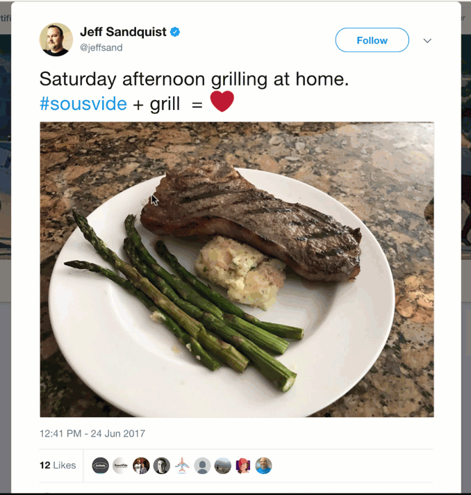
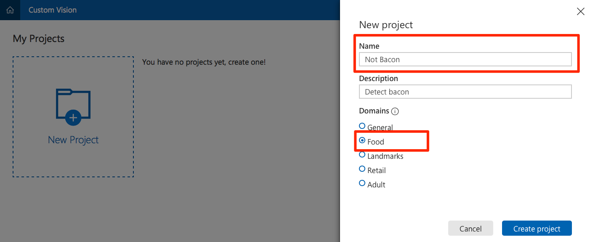
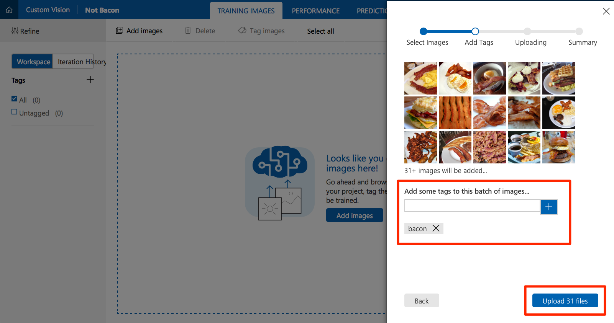
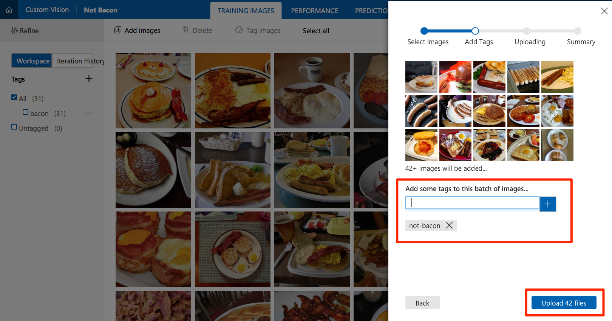
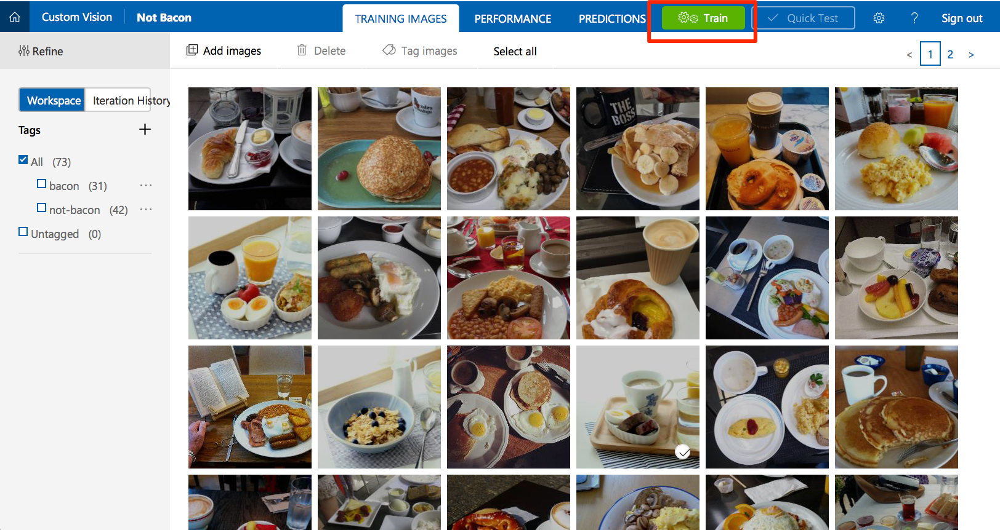
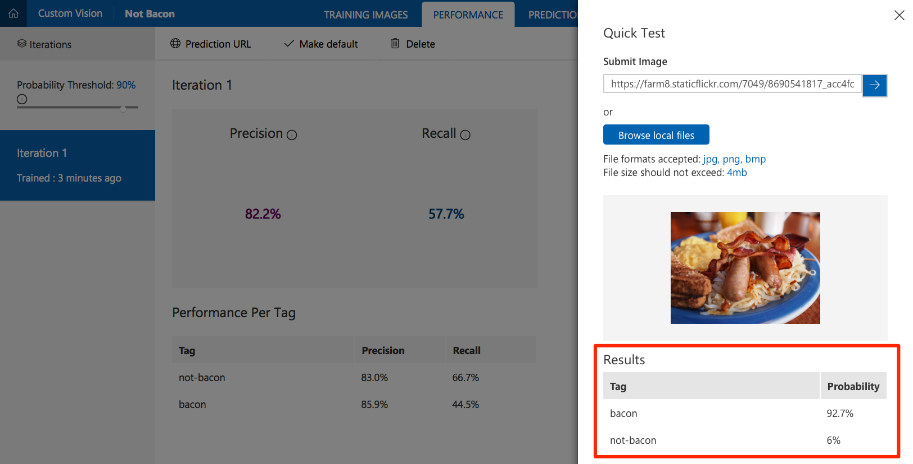
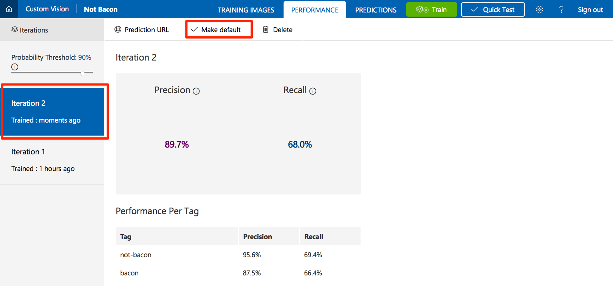
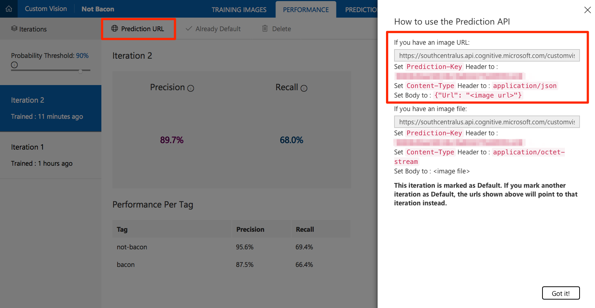
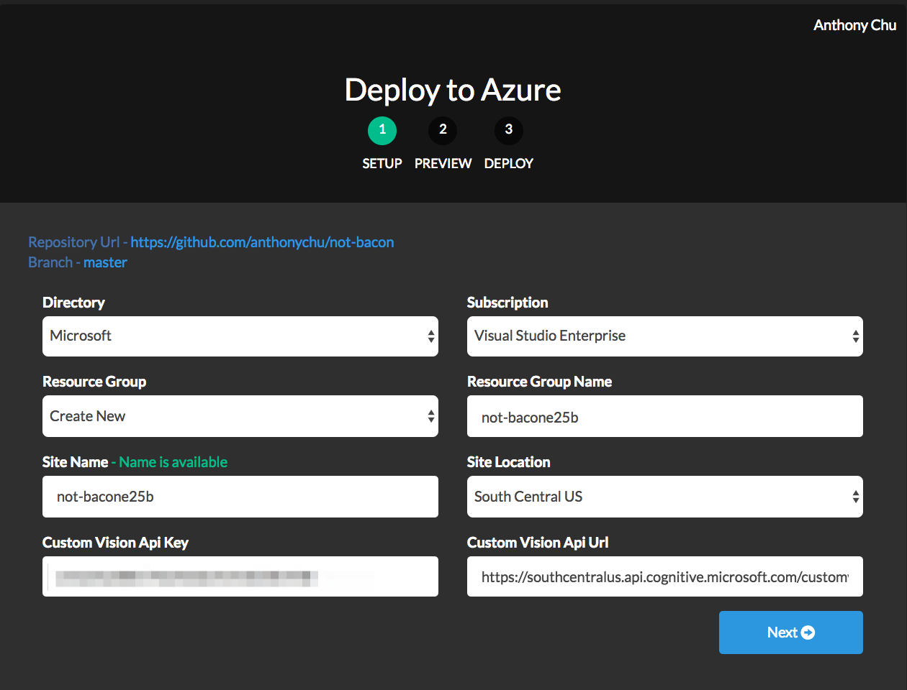
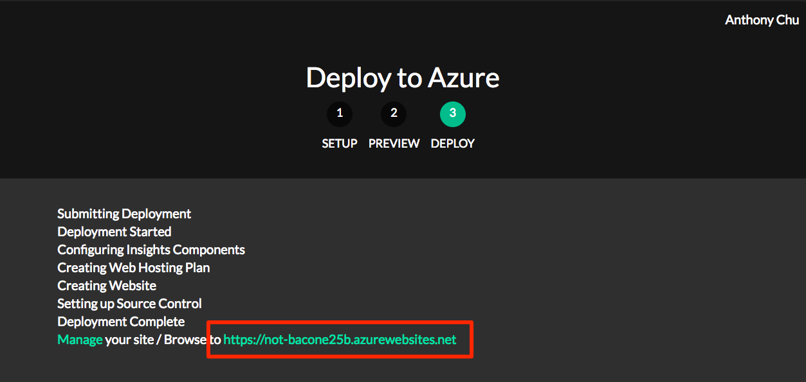

[!include[](includes/header.md)]

# NotBacon
[NotBacon](https://github.com/anthonychu/not-bacon) is a web application that detects the presence of bacon in a photograph. This project is written in C# and JavaScript, and uses Azure's [Custom Vision Service](https://customvision.ai), part of the [Cognitive Services](https://azure.microsoft.com/services/cognitive-services/) collection, to perform the image recognition using a customized image classifier.  

[](https://azuredeploy.net/?repository=https://github.com/anthonychu/not-bacon)

## Requirements
* An [Azure](https://azure.microsoft.com/en-us/free/) account

## Links
* [NotBacon Repo](https://github.com/anthonychu/not-bacon)

## What's It Do?
The application consists of two components:
* A Custom Vision Service project - allows you to build a custom image classifier to detect bacon in a photo.
* An Azure Web App - displays a web interface for users to submit photos.



## Configuration

### Create a Custom Vision Service account

1. Navigate to [customvision.ai](https://customvision.ai/).
1. Click **Sign in** and log in with your Microsoft Account.

### Create and train a Custom Vision project

1. Click on **New Project**.
    * Provide a name for the project.
    * Select **Food** as the domain to optimize the model to work with plates of food.

    

1. Obtain a variety of photos. To properly train your model, you need at least 30 photos that contain bacon, and 30 that do not. Download and separate the photos into two folders: `bacon` and `not-bacon`.
    > Tip: A good place to find photos is by doing an internet image search for `breakfast`. The list of images used in the training set for this article is [here](https://github.com/anthonychu/not-bacon/blob/master/cc-attributions.md).

1. Click on **Add Images** and select all the photos you previously downloaded in the `bacon` folder.
    * Create a tag named `bacon`, click **+** to add it.
    * Click **Upload** to upload the photos and tag them as `bacon`.

    
    
1. Click on **Add Images** again to add images from the `not-bacon` folder. This time, tag them as `not-bacon`.
    
    

1. Click **Train** to train the image classifier. When training is complete, your model is ready to use.
    
    

1. Click **Quick Test** to test your classifier. Find a photo that was *not* in your training set. **Browse local files** to upload it or enter its URL. Check that the model correctly predicted the tags for the photo.
    
    

### Obtain Custom Vision Service API information

In order to configure the web application, you need some information about the Custom Vision Service project you created.

1. Select the **Performance** tab in your project.
1. If you have trained your model more than once, select the latest iteration and click **Make Default**. The default REST API endpoint of your project is set to use this iteration of the model.
    
    

1. Click on **Prediction URL**. Under the "If you have an image URL" section, copy the API endpoint URL and the prediction key value for use in the next step.
    
    

### Deploy to a Web App

1. Click the [Deploy to Azure link](https://azuredeploy.net/?repository=https://github.com/anthonychu/not-bacon) here or the button at the top of this page.
1. If prompted, sign in to your Azure account.
1. Enter the information for your new application, such as the resource group name, site name, etc.
1. Fill in the **Custom Vision API Key** and **Custom Vision API URL** with the values that you previously copied.



1. Click **Next** and then **Deploy**.

### Test the web application



1. If the application is successfully deployed, the Deploy to Azure tool displays a URL. Open the application by clicking on the link.
1. Find a photo on the internet, paste its URL in the URL text box, and click **Submit**.
1. The application should display whether or not bacon was detected in the photo.

## How it works

The web application calls the Custom Vision Service REST API with the URL of the image to be analyzed in the body. Here is an example of the JSON response:

```json
{
    "Id": "38d1249f-7153-4c2b-aa11-292bf9bd7085",
    "Project": "736b29fa-0c84-4f3e-87ee-201012399fd7",
    "Iteration": "d27e017e-c162-4c10-9610-19772d5e5049",
    "Created": "2017-08-21T17:48:26.2785384Z",
    "Predictions": [
        {
            "TagId": "017dab76-8630-4ef4-9cd0-46cec6b01655",
            "Tag": "bacon",
            "Probability": 0.845978856
        },
        {
            "TagId": "bf9f817a-ed74-4bb3-8e9d-49f1b3b7a4bb",
            "Tag": "no-bacon",
            "Probability": 0.041467078
        }
    ]
}
```

The application reads the `bacon` probability and considers a score greater than 0.7 as a successful match.

## Next Steps
Here are links to the docs for the items discussed above.  Play around with the project and feel free to leave comments on the article, [open issues](https://github.com/anthonychu/not-bacon/issues) in the repo, or submit [pull requests](https://github.com/anthonychu/not-bacon/pulls) with fixes and new features.  Enjoy!

* Custom Vision Service [documentation](https://docs.microsoft.com/azure/cognitive-services/custom-vision-service/home)
* How to [Improve your classifier](https://docs.microsoft.com/azure/cognitive-services/custom-vision-service/getting-started-improving-your-classifier)


[List of images used for training](https://github.com/anthonychu/not-bacon/blob/master/cc-attributions.md)