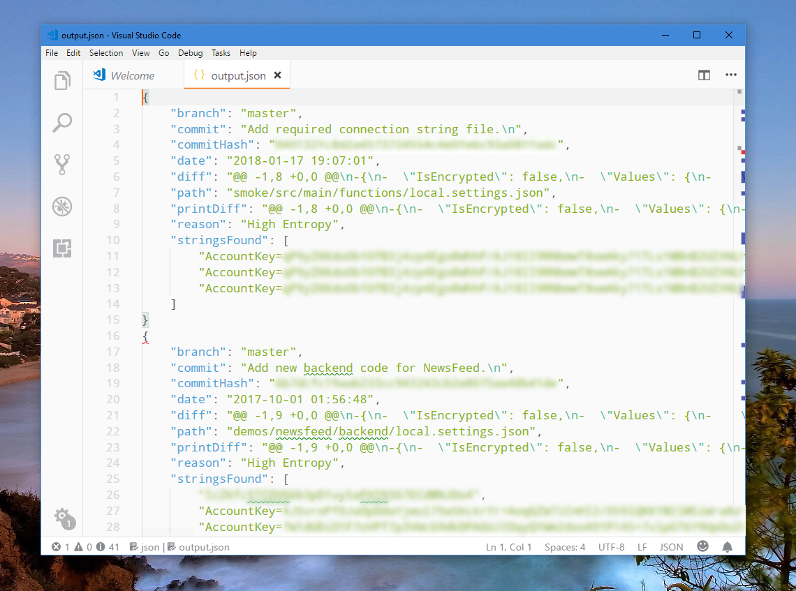
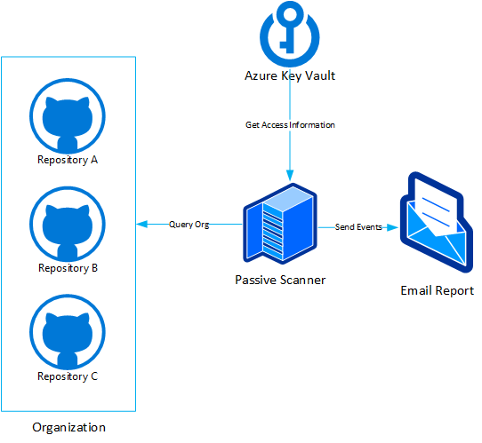

# Scanning Your Repos for Credentials - In the Cloud

You have an organization in GitHub. You have employees that check in code from all over the world, with tens and hundreds of commits happening daily. You are excited about all the code - after all, open source is meant to make your life easier. However, what happens if someone accidentally checks in your storage account keys into source control as well? How soon will you find out about that before it's too late?

The objective of this article is to show you how you can deploy a credential scanner tool to the cloud and have it scan your repositories to make sure that no private information is exposed.

## Toolchain

For the purpose of this tutorial, we will use [TruffleHog][0], an open source command-line tool that can scan public repositories for content that resembles private keys or passwords. We'll start by running it locally, to get an idea of how it works, and later will prepare it for the cloud.

To make sure that you can run TruffleHog, install [Python 3][1] - instructions might vary from machine to machine, so we will abstract this part out. You will also need [Docker][2] readily available.

## Getting Started

As I mentioned earlier, let's start by trying to run the tool locally to see the kind of output we are getting, and how we can ingest it. The big benefit of TruffleHog is that it traverses the entire commit history - even though after you checked in a private key you might've checked in code to remove it, the actual key will still reside somewhere deep in the history - you want to be aware of that.

To get started, make sure to install TruffleHog via `pip`:

```python
pip install trufflehog
```

![Installation of TruffleHog via pip][i0]

>[!TIP]
>To avoid any permission issues, we recommend you test the tooling in a Python virtual environment. You can read more about those in [The Hitchhiker's Guide to Python][3].

Next, I am going to run the tool on a test sample repository. I will route the output of the tool into a JSON file, with the help of `--json` and `>> output.json`:

```python
trufflehog --regex https://github.com/{USER_ID}/{REPO_ID}.git --json >> output.json
```

![Running TruffleHog locally][i1]

Once the tool runs and we look at the output JSON file, we will notice that there are some strings found in the file that should trigger some action on the repo contributor's part:



>[!IMPORTANT]
>The TruffleHog tool currently does not output valid JSON due to the fact that it does not properly merge array entries. So for each set of findings, you will have a valid element group, but if there is more than one finding, there will be missing separators (commas) between them.

Some repos are extremely large and have a very extensive commit history. For those cases, we might want to set the depth limit, that determines how many commits down the tree the tool will scan for credentials:

```python
trufflehog --regex https://github.com/{USER_ID}/{REPO_ID}.git --json --max-depth 7 >> output.json
```

We now have an idea of how the tool runs. However, there is an unfortunate limitation - we need to run it on a per-repo basis. If you have an organization which you need to scan on a more-or-less constant basis, this won't work out-of-the-box. So let's make sure that we design a solution on top of this tool that scales a bit better.

In terms of cloud infrastructure, there are several components that we can leverage:

* [Azure KeyVault][4] - to get access information for the script (to be able to query private orgs in GitHub)
* [Azure Event Hubs][5] - to track events when they are triggered/information is collected from TruffleHog.
* [Azure Cosmos DB][6] - to collect the discovered data.

There is a couple of things that we can do here to make sure that the workflow is fully automated and you, as the customer, have nothing to worry about after the first set up. So we end up with an architecture like:



[0]: https://github.com/dxa4481/truffleHog
[1]: https://www.python.org/downloads/
[2]: https://docs.docker.com/install/
[3]: http://docs.python-guide.org/en/latest/dev/virtualenvs/
[4]: https://docs.microsoft.com/en-us/azure/key-vault/
[5]: https://docs.microsoft.com/en-us/azure/event-hubs/
[6]: https://docs.microsoft.com/en-us/azure/cosmos-db/

[i0]: media/trufflehog/install.gif
[i1]: media/trufflehog/test-tool.gif
[i2]: media/trufflehog/findings.png
[i2]: media/trufflehog/arch.png