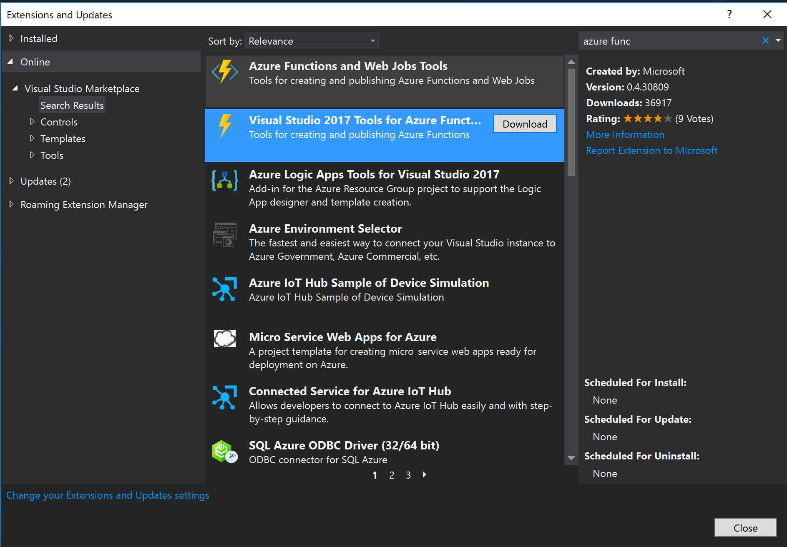

## Installing Visual Studio Functions Tools

Azure Function tools for Visual Studio is an extension that provides easy development, deployment, and testing of functions within Visual Studio. You can install function tools in Visual Studio 2017 through the Extensions and Updates dialog in the Tools menu. To bring the extension to the top of the search results, type "Azure function" in the search box. Once downloaded,the extension will be ready for use after Visual Studio is restarted. 

[!include]

- Azure Function Tools for Visual Studio can be installed through the Extension and Updates dialog within Visual Studio.
- You can create, test, and deploy functions within Visual Studio with Azure Function Tools for Visual Studio.

[!include]

- [Azure Functions Tools for Visual Studio](https://msdn.microsoft.com/library/azure/microsoft.azure.documents.client.documentclient.aspx)
- [Code and test Azure functions locally](https://docs.microsoft.com/en-us/azure/azure-functions/functions-run-local)
- [.NET Web Development and Tools Blog - Visual Studio 2017 Tools for Azure Functions](https://blogs.msdn.microsoft.com/webdev/2017/05/10/azure-function-tools-for-visual-studio-2017/)