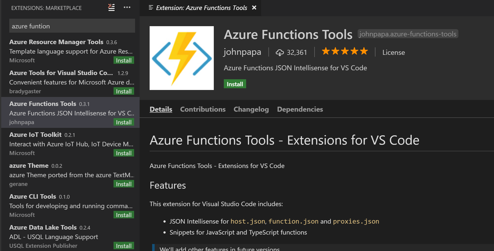

## Installing Visual Studio Code Function Tools

Azure Function tools for Visual Studio Code is an extension that provides easy development of functions with Intellisense for `host.json`, `function.json` and `proxies.json`. To bring the extension to the top of the search results, type "Azure function" in the search box.

[!include]

- Azure Functions Tools for Visual Studio Code can be installed in the Extensions menu.

[!include]

- [Azure Functions Tools for VS Code GitHub Repository](https://github.com/johnpapa/vscode-azure-functions-tools)
