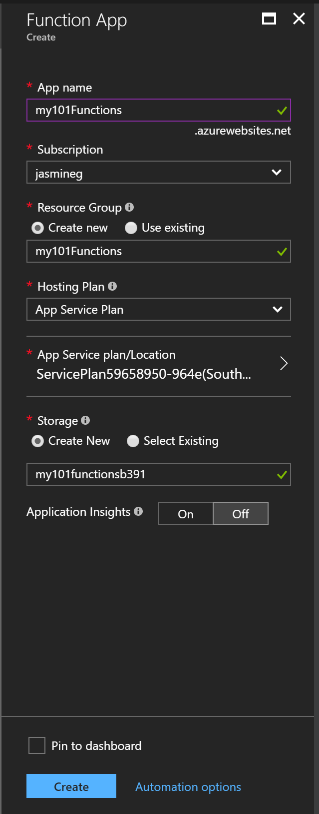
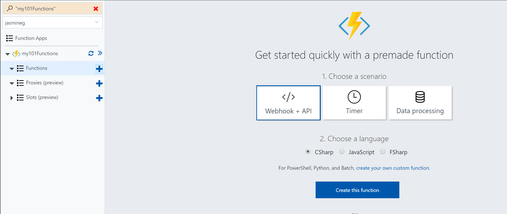
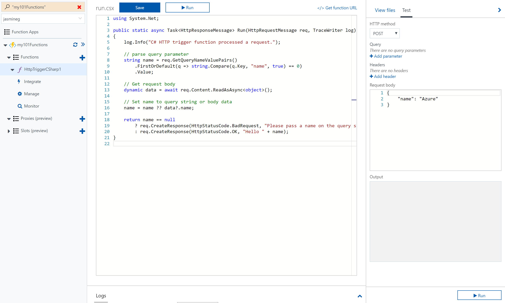

## Working with Functions in the Azure Portal

Functions can be created, configured, and tested in the Azure Portal. To create a function, you must first create a Function App to host execution of functions. This can be found by clicking the + button in the top left corner and searching for Function App in the Marketplace.

Once configured and created, navigate to the new function app, expand it, and click the + button next to Functions. Select a function to create and the language, and click "Create this function." This example will be working with a generic HTTP function trigger.

In the portal view of the function, the left side has a list of the editable function files and a test view. Function files can be edited in the portal and also tested by clicking the "Run" button at the bottom of the test view.

[!include]
- Functions can be created, and tested in the Portal.
- Function apps host functions.

[!include]
- [Create your first function in the Azure portal](https://docs.microsoft.com/en-us/azure/azure-functions/functions-create-first-azure-function)

