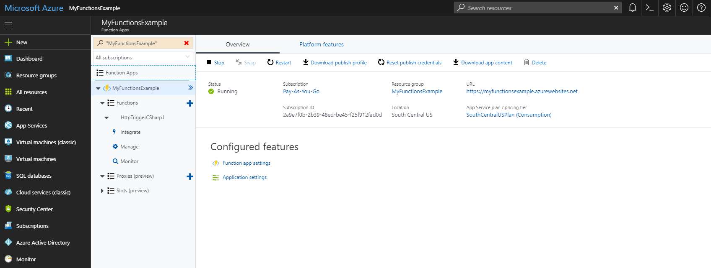
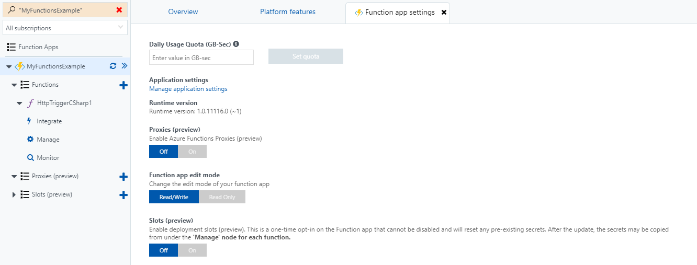

## Controlling how much your function can run in one day

Azure Functions measures the run time of functions in GB-seconds. To avoid being overbilled, Azure Functions gives the user the ability to set Daily Usage Quotas for their function apps. When an app hits the quota, it will cease to run until midnight UTC. To set this limit, first access your app in the Azure Portal, and navigate to the Overview tab.

Click through to the Function app settings page to get to the Daily Usage Quota (GB-sec) field. From there you can enter your desired quota in GB-seconds. 

[!include]

- A function's use is measured in GB-seconds
- Azure Functions can have their usage limited by the Daily Usage Quota setting in the function app settings. 

[!include]

- [More on Function app settings](https://docs.microsoft.com/en-us/azure/azure-functions/functions-how-to-use-azure-function-app-settings)