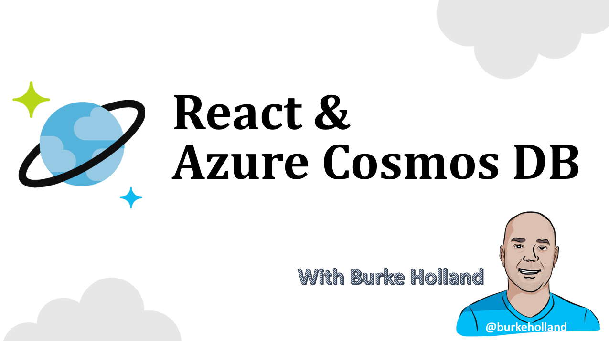

# React & Azure Comsos DB

[!include]

Welcome to the React & Azure Cosmos DB video series. 

In this course, we'll cover how to build a complete application using React for the user interface, Express and Node for the server and Azure Cosmos DB for the database. We'll look at how to depoy this application to Azure, as well as how to scale Azure Cosmos DB so that the application stays fast and responsive anywhere in the world.

Let's go!

## Requirements
* [Node](http://nodejs.org)
* This series assumes that you have a basic understanding of JavaScript, React and Node.js.

## Links
* [Completed Project](https://github.com/burkeholland/react-cosmosdb)

## Videos

<iframe width="560" height="315" src="https://www.youtube.com/embed/mcBUdC_978A" frameborder="0" allowfullscreen></iframe>

* [Part 2: Project Setup](https://youtu.be/LmAhD_ILNrk)
* [Part 3: Creating The UI](https://youtu.be/NIg5VJA5BQw)
* [Part 4: Azure Cosmos DB](https://youtu.be/AiVy1RjSpG4)
* [Part 5: Azure Cosmos DB Read And Create](https://youtu.be/TYwYkQqPotM)
* [Part 6: Azure Cosmos DB Delete And Update](https://youtu.be/mKzk_5RQz28)
* [Part 7: Completing The Application](https://youtu.be/Jhma0SNbAvk)
* Part 8: Scaling (Coming Soon)
* Part 9: Deployment (Coming Soon)

## Next Steps
* [Cosmos DB Quickstart](https://docs.microsoft.com/en-us/azure/cosmos-db/create-mongodb-nodejs)
* [Burke's Blog](http://https://medium.com/burke-knows-words)